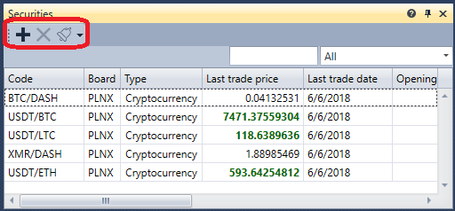

# Instrumentos

El componente **Instrumentos** es una tabla con instrumentos que muestra información sobre todos los instrumentos seleccionados.

Para añadir un nuevo instrumento, haga clic en el botón .

También es posible configurar notificaciones para eventos de los instrumentos seleccionados: [Configuración de notificaciones](../../notifications.md).

## Contenido recomendado

[Level 1](level_1.md)
