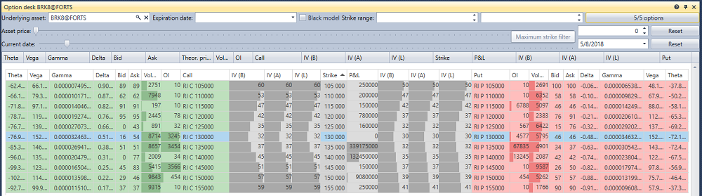

# Mesa de opciones

El componente **Mesa de opciones** es una tabla con los principales parámetros de las opciones seleccionadas para el instrumento subyacente.

Para mostrar la mesa de opciones, debe seleccionar el activo subyacente y las opciones necesarias.

Además, puede especificar un filtro para la fecha exacta de vencimiento de las opciones y filtros para strikes mínimos\/máximos.

## Contenido recomendado

[Sonrisa de volatilidad](smile_volatility.md)
