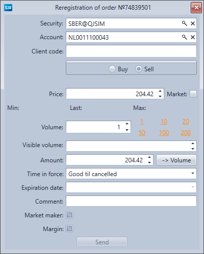

# Órdenes

El componente **Órdenes** es una tabla con órdenes que muestra información completa sobre todas las órdenes. Al hacer clic derecho sobre la orden, aparece un panel con el que puede registrar una nueva orden, cancelar o cambiar la orden seleccionada.

Al hacer clic en el botón **Registro de orden**, aparece una ventana. Para registrar una nueva orden, rellénela y haga clic en **Enviar**.

Al hacer clic en el botón **Modificar orden**, aparece una ventana. Para cambiar la orden, realice los cambios necesarios y haga clic en **Enviar**.

## Contenido recomendado

[Operaciones](../../../designer/user_interface/components/trades.md)
