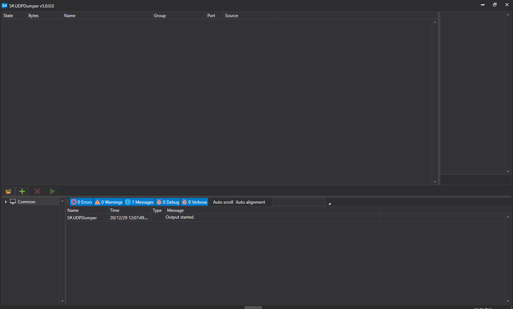

# UDP Dumper

**UDPDumper** registra paquetes UDP. Puede usarse para verificar la configuración de red proporcionada por un broker o una bolsa y para recopilar datos para pruebas posteriores de conectores basados en UDP, como [FAST](api/connectors/common/fast_protocol.md) o SBE.

Instale UDPDumper mediante [Installer](installer.md).

## Configuración y ejecución

1. En el primer inicio, la aplicación muestra lo siguiente:
2. Para añadir flujos de red, agréguelos manualmente o cargue todos los flujos desde los archivos de configuración de la bolsa. Para ello, haga clic en el botón:
3. En la ventana que aparece, debe encontrar el archivo de configuración deseado de la bolsa y abrirlo:
4. Todos los flujos con direcciones IP y configuración de puertos se cargarán desde un archivo:
5. Seleccione los flujos necesarios y haga clic en el botón de iniciar descarga:
6. Si la configuración es correcta, el programa comenzará a recibir datagramas UDP y a escribirlos en disco. La aplicación mostrará el número de bytes recibidos para cada flujo:
7. **UDPDumper** tiene interfaz gráfica. Si necesita ejecutarlo sin interfaz gráfica, por ejemplo en Linux, use **UDPDumper.Console**, la versión de consola multiplataforma.

   La aplicación **UDPDumper.Console** recibe como parámetro la ruta al archivo creado por la versión UI (exactamente la versión UI, y **no una configuración de bolsa**):

   ```cs
   		StockSharp.UdpDumper.Console.exe settings.json
   		
   ```
8. Para probar un conector con los datos recopilados, use el modo de volcado. Para más detalles, consulte [Modo de volcado](api/connectors/common/fast_protocol/dump_mode.md).
