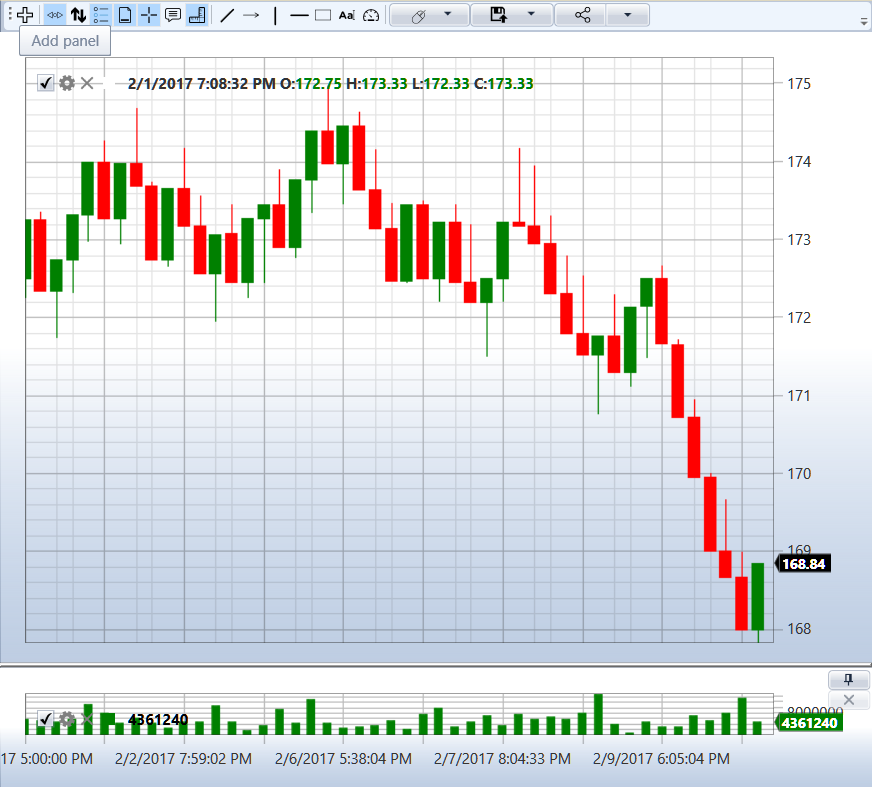

# キャンドル

[S#](../api.md) は、次の種類のキャンドルをサポートします:

- [TimeFrameCandleMessage](xref:StockSharp.Messages.TimeFrameCandleMessage) - 時間間隔、つまりタイムフレームに基づくキャンドルです。一般的な間隔 (分、時間、日足) とカスタム間隔の両方を設定できます。たとえば、21 秒、4.5 分などです。
- [RangeCandleMessage](xref:StockSharp.Messages.RangeCandleMessage) - 価格レンジキャンドルです。許容範囲を超える価格の約定が発生すると、新しいキャンドルが作成されます。許容範囲は、毎回最初の約定価格に基づいて形成されます。
- [VolumeCandleMessage](xref:StockSharp.Messages.VolumeCandleMessage) - 約定の合計出来高が指定された上限を超えるまでキャンドルが形成されます。新しい約定が許容出来高を超える場合、その約定は新しいキャンドルに含まれます。
- [TickCandleMessage](xref:StockSharp.Messages.TickCandleMessage) - [VolumeCandleMessage](xref:StockSharp.Messages.VolumeCandleMessage) と同じですが、制限として出来高ではなく約定数を使用します。
- [PnFCandleMessage](xref:StockSharp.Messages.PnFCandleMessage) - ポイントアンドフィギュアチャートのキャンドル (X-O チャート) です。
- [RenkoCandleMessage](xref:StockSharp.Messages.RenkoCandleMessage) - Renko キャンドルです。

キャンドルの扱い方は、*Samples\/02\_Candles\/01\_Realtime* フォルダーにある例で示されています。

次の画像は、[TimeFrameCandleMessage](xref:StockSharp.Messages.TimeFrameCandleMessage) と [RangeCandleMessage](xref:StockSharp.Messages.RangeCandleMessage) のチャートを示しています:




## データ取得の開始

1. キャンドルを取得するには、[Subscription](xref:StockSharp.BusinessEntities.Subscription) クラスを使用してサブスクリプションを作成します:

```cs
// 5 分足キャンドルへのサブスクリプションを作成
var subscription = new Subscription(
	DataType.TimeFrame(TimeSpan.FromMinutes(5)),  // タイムフレーム指定付きのデータ型
	security)  // 銘柄
{
	// MarketData プロパティを通じて追加パラメーターを設定
	MarketData = 
	{
		// 履歴データをリクエストする期間 (直近 30 日)
		From = DateTime.Today.Subtract(TimeSpan.FromDays(30)),
		To = DateTime.Now
	}
};
```

2. キャンドルを受信するには、処理対象の新しい値が出現したことを通知する [Connector.CandleReceived](xref:StockSharp.Algo.Connector.CandleReceived) イベントをサブスクライブします:

```cs
// キャンドル受信イベントをサブスクライブ
_connector.CandleReceived += OnCandleReceived;

// キャンドル受信イベントハンドラー
private void OnCandleReceived(Subscription subscription, ICandleMessage candle)
{
	// ここで subscription は作成したサブスクリプションオブジェクト
	// candle - 受信したキャンドル
	
	// キャンドルが自分のサブスクリプションに属しているか確認
	if (subscription == _candleSubscription)
	{
		// チャートにキャンドルを描画
		Chart.Draw(_candleElement, candle);
	}
}
```

> [!TIP]
> [Chart](xref:StockSharp.Xaml.Charting.Chart) グラフィカルコンポーネントは、キャンドルの表示に使用されます。

3. 次に、[Connector.Subscribe](xref:StockSharp.Algo.Connector.Subscribe(StockSharp.BusinessEntities.Subscription)) メソッドを通じてサブスクリプションを開始します:

```cs
// サブスクリプションを開始
_connector.Subscribe(subscription);
```

この後、[Connector.CandleReceived](xref:StockSharp.Algo.Connector.CandleReceived) イベントが呼び出され始めます。

4. [Connector.CandleReceived](xref:StockSharp.Algo.Connector.CandleReceived) イベントは、新しいキャンドルが出現したときだけでなく、現在のキャンドルが変化したときにも呼び出されます。

**"complete"** キャンドルのみを表示する必要がある場合は、受信したキャンドルの [ICandleMessage.State](xref:StockSharp.Messages.ICandleMessage.State) プロパティを確認する必要があります:

```cs
private void OnCandleReceived(Subscription subscription, ICandleMessage candle)
{
	// キャンドルが自分のサブスクリプションに属しているか確認
	if (subscription != _candleSubscription)
		return;
	
	// キャンドルが完了しているか確認
	if (candle.State == CandleStates.Finished) 
	{
		// 描画用データを作成
		var chartData = new ChartDrawData();
		chartData.Group(candle.OpenTime).Add(_candleElement, candle);
		
		// チャートにキャンドルを描画
		this.GuiAsync(() => Chart.Draw(chartData));
	}
}
```

5. サブスクリプションには追加パラメーターを設定できます:

- **キャンドル構築モード** - 既製データをリクエストするか、別のデータ型から構築するかを決定します:

```cs
// 既製データのみをリクエスト
subscription.MarketData.BuildMode = MarketDataBuildModes.Load;

// 別のデータ型からのみ構築
subscription.MarketData.BuildMode = MarketDataBuildModes.Build;

// 既製データをリクエストし、利用できない場合は構築
subscription.MarketData.BuildMode = MarketDataBuildModes.LoadAndBuild;
```

- **キャンドル構築元** - 直接利用できない場合に、どのデータ型からキャンドルを構築するかを示します:

```cs
// ティック約定からキャンドルを構築
subscription.MarketData.BuildFrom = DataType.Ticks;

// 板情報からキャンドルを構築
subscription.MarketData.BuildFrom = DataType.MarketDepth;

// Level1 からキャンドルを構築
subscription.MarketData.BuildFrom = DataType.Level1;
```

- **キャンドル構築用フィールド** - 特定のデータ型では指定が必要です:

```cs
// Level1 の最良買気配価格からキャンドルを構築
subscription.MarketData.BuildField = Level1Fields.BestBidPrice;

// Level1 の最良売気配価格からキャンドルを構築
subscription.MarketData.BuildField = Level1Fields.BestAskPrice;

// 板情報内のスプレッド中央値からキャンドルを構築
subscription.MarketData.BuildField = Level1Fields.SpreadMiddle;
```

- **出来高プロファイル** - キャンドルの出来高プロファイル計算:

```cs
// 出来高プロファイル計算を有効化
subscription.MarketData.IsCalcVolumeProfile = true;
```

## さまざまなキャンドルタイプへのサブスクリプション例

### 標準タイムフレームのキャンドル

```cs
// 5 分足キャンドル
var timeFrameSubscription = new Subscription(
	DataType.TimeFrame(TimeSpan.FromMinutes(5)),
	security);
_connector.Subscribe(timeFrameSubscription);
```

### 履歴キャンドルのみを読み込む

```cs
// リアルタイムへ移行せず、履歴キャンドルのみを読み込む
var historicalSubscription = new Subscription(
	DataType.TimeFrame(TimeSpan.FromMinutes(5)),
	security)
{
	MarketData =
	{
		From = DateTime.Today.Subtract(TimeSpan.FromDays(30)),
		To = DateTime.Today,  // 終了日を指定
		BuildMode = MarketDataBuildModes.Load  // 既製データのみを読み込む
	}
};
_connector.Subscribe(historicalSubscription);
```

### ティックから非標準タイムフレームのキャンドルを構築する

```cs
// ティックから構築される 21 秒タイムフレームのキャンドル
var customTimeFrameSubscription = new Subscription(
	DataType.TimeFrame(TimeSpan.FromSeconds(21)),
	security)
{
	MarketData =
	{
		BuildMode = MarketDataBuildModes.Build,
		BuildFrom = DataType.Ticks
	}
};
_connector.Subscribe(customTimeFrameSubscription);
```

### 板情報データからキャンドルを構築する

```cs
// 板情報内のスプレッド中央値から構築されるキャンドル
var depthBasedSubscription = new Subscription(
	DataType.TimeFrame(TimeSpan.FromMinutes(1)),
	security)
{
	MarketData =
	{
		BuildMode = MarketDataBuildModes.Build,
		BuildFrom = DataType.MarketDepth,
		BuildField = Level1Fields.SpreadMiddle
	}
};
_connector.Subscribe(depthBasedSubscription);
```

### 出来高プロファイル付きキャンドル

```cs
// 出来高プロファイル計算付き 5 分足キャンドル
var volumeProfileSubscription = new Subscription(
	DataType.TimeFrame(TimeSpan.FromMinutes(5)),
	security)
{
	MarketData =
	{
		BuildMode = MarketDataBuildModes.LoadAndBuild,
		BuildFrom = DataType.Ticks,
		IsCalcVolumeProfile = true
	}
};
_connector.Subscribe(volumeProfileSubscription);
```

### 出来高キャンドル

```cs
// 出来高キャンドル (各キャンドルに出来高 1000 コントラクトを含む)
var volumeCandleSubscription = new Subscription(
	DataType.Volume(1000m),  // キャンドルタイプと出来高を指定
	security)
{
	MarketData =
	{
		BuildMode = MarketDataBuildModes.Build,
		BuildFrom = DataType.Ticks
	}
};
_connector.Subscribe(volumeCandleSubscription);
```

### ティック数キャンドル

```cs
// ティック数キャンドル (各キャンドルに 1000 約定を含む)
var tickCandleSubscription = new Subscription(
	DataType.Tick(1000),  // キャンドルタイプと約定数を指定
	security)
{
	MarketData =
	{
		BuildMode = MarketDataBuildModes.Build,
		BuildFrom = DataType.Ticks
	}
};
_connector.Subscribe(tickCandleSubscription);
```

### 価格レンジキャンドル

```cs
// レンジ 0.1 単位の価格レンジキャンドル
var rangeCandleSubscription = new Subscription(
	DataType.Range(0.1m),  // キャンドルタイプと価格レンジを指定
	security)
{
	MarketData =
	{
		BuildMode = MarketDataBuildModes.Build,
		BuildFrom = DataType.Ticks
	}
};
_connector.Subscribe(rangeCandleSubscription);
```

### Renko キャンドル

```cs
// ステップ 0.1 の Renko キャンドル
var renkoCandleSubscription = new Subscription(
	DataType.Renko(0.1m),  // キャンドルタイプとブロックサイズを指定
	security)
{
	MarketData =
	{
		BuildMode = MarketDataBuildModes.Build,
		BuildFrom = DataType.Ticks
	}
};
_connector.Subscribe(renkoCandleSubscription);
```

### ポイントアンドフィギュアキャンドル (P&F)

```cs
// ポイントアンドフィギュアキャンドル
var pnfCandleSubscription = new Subscription(
	DataType.PnF(new PnfArg { BoxSize = 0.1m, ReversalAmount = 1 }),  // P&F パラメーターを指定
	security)
{
	MarketData =
	{
		BuildMode = MarketDataBuildModes.Build,
		BuildFrom = DataType.Ticks
	}
};
_connector.Subscribe(pnfCandleSubscription);
```

## 次のステップ

[チャート](candles/chart.md)

[カスタムキャンドルタイプ](candles/custom_type_of_candle.md)

