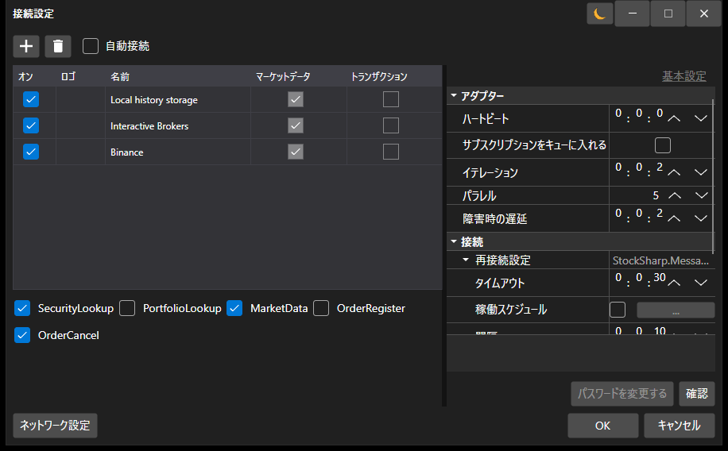

# コネクター

[S#](../api.md) で取引所やデータソースを扱うには、基底クラス [Connector](xref:StockSharp.Algo.Connector) を使用することを推奨します。

[Connector](xref:StockSharp.Algo.Connector) の利用方法を見てみましょう。この例のソースコードは Samples\/01\_Basic\/01\_ConnectAndDownloadInstruments プロジェクトにあります。


[Connector](xref:StockSharp.Algo.Connector) クラスのインスタンスを作成します。

```cs
...
public Connector Connector;
...
public MainWindow()
{
	InitializeComponent();
	Connector = new Connector();
	InitConnector();
}
		
```

[Connector](xref:StockSharp.Algo.Connector) を設定するために、**API** には複数の接続を同時に設定できる専用のグラフィカルインターフェイスがあります。使用方法は [グラフィカル設定](connectors/graphical_configuration.md) セクションで説明されています。

```cs
...
private readonly IFileSystem _fileSystem = Paths.FileSystem;
private const string _connectorFile = "ConnectorFile.json";
...
private void Setting_Click(object sender, RoutedEventArgs e)
{
	if (Connector.Configure(this))
	{
		Connector.Save().Serialize(_fileSystem, _connectorFile);
	}
}

```



同様に、拡張メソッド [TraderHelper.AddAdapter\<TAdapter\>](xref:StockSharp.Algo.TraderHelper.AddAdapter``1(StockSharp.Algo.Connector,System.Action{``0}))**(**[StockSharp.Algo.Connector](xref:StockSharp.Algo.Connector) connector, [System.Action\<TAdapter\>](xref:System.Action`1) init **)** を使用することで、グラフィカルウィンドウを使わずにコードから直接接続を追加できます。

```cs
...
// Binance に接続するためのアダプターを追加
connector.AddAdapter<BinanceMessageAdapter>(a => 
{
	a.Key = "<Your API Key>";
	a.Secret = "<Your Secret Key>";
});

// ニュース用 RSS を追加
connector.AddAdapter<RssMessageAdapter>(a => 
{
	a.Address = "https://news-source.com/feed";
});
	  				
```

1 つの [Connector](xref:StockSharp.Algo.Connector) オブジェクトには、無制限の数の接続を追加できます。そのため、プログラムから複数の取引所やブローカーへ同時に接続できます。

*InitConnector* メソッドでは、[IConnector](xref:StockSharp.BusinessEntities.IConnector) に必要なイベントハンドラーを設定します。

```cs
private void InitConnector()
{
	// 接続成功イベントを購読
	Connector.Connected += () =>
	{
		this.GuiAsync(() => ChangeConnectStatus(true));
	};
	
	// 接続エラーイベントを購読
	Connector.ConnectionError += error => this.GuiAsync(() =>
	{
		ChangeConnectStatus(false);
		MessageBox.Show(this, error.ToString(), LocalizedStrings.ErrorConnection);
	});
	
	// 切断イベントを購読
	Connector.Disconnected += () => this.GuiAsync(() => ChangeConnectStatus(false));
	
	// エラーイベントを購読
	Connector.Error += error =>
		this.GuiAsync(() => MessageBox.Show(this, error.ToString(), LocalizedStrings.Str2955));
	
	// マーケットデータ購読失敗イベントを購読
	Connector.SubscriptionFailed += (subscription, error, isSubscribe) =>
		this.GuiAsync(() => MessageBox.Show(this, error.ToString(), 
			LocalizedStrings.Str2956Params.Put(subscription.DataType, subscription.SecurityId)));
	
	// データ受信用の購読
	
	// 銘柄
	Connector.SecurityReceived += (sub, security) => _securitiesWindow.SecurityPicker.Securities.Add(security);
	
	// ティック取引
	Connector.TickTradeReceived += (sub, trade) => _tradesWindow.TradeGrid.Trades.TryAdd(trade);
	
	// 注文
	Connector.OrderReceived += (sub, order) => _ordersWindow.OrderGrid.Orders.TryAdd(order);
	
	// 自己取引
	Connector.OwnTradeReceived += (sub, trade) => _myTradesWindow.TradeGrid.Trades.TryAdd(trade);
	
	// ポジション
	Connector.PositionReceived += (sub, position) => _portfoliosWindow.PortfolioGrid.Positions.TryAdd(position);

	// 注文登録失敗
	Connector.OrderRegisterFailReceived += (sub, fail) => _ordersWindow.OrderGrid.AddRegistrationFail(fail);
	
	// 注文キャンセル失敗
	Connector.OrderCancelFailReceived += (sub, fail) => OrderFailed(fail);
	
	// マーケットデータプロバイダーを設定
	_securitiesWindow.SecurityPicker.MarketDataProvider = Connector;
	
	try
	{
		if (File.Exists(_connectorFile))
		{
			var ctx = new ContinueOnExceptionContext();
			ctx.Error += ex => ex.LogError();
			using (new Scope<ContinueOnExceptionContext>(ctx))
				Connector.Load(_connectorFile.Deserialize<SettingsStorage>(_fileSystem));
		}
	}
	catch
	{
	}
	
	ConfigManager.RegisterService<IExchangeInfoProvider>(new InMemoryExchangeInfoProvider());
	
	// グラフィカル設定用のアダプタープロバイダーを登録
	ConfigManager.RegisterService<IMessageAdapterProvider>(
		new InMemoryMessageAdapterProvider(Connector.Adapter.InnerAdapters));
}
```

[Connector](xref:StockSharp.Algo.Connector) の設定をファイルへ保存し、ファイルから読み込む方法は [設定の保存と読み込み](connectors/save_and_load_settings.md) セクションにあります。

独自の [Connector](xref:StockSharp.Algo.Connector) を作成する方法については、[独自コネクターの作成](connectors/creating_own_connector.md) セクションを参照してください。

注文の発注については、[注文](orders_management.md)、[新規注文の作成](orders_management/create_new_order.md)、[新規ストップ注文の作成](orders_management/create_new_stop_order.md) の各セクションで説明されています。

## 追加機能

### IFileSystem と Paths.FileSystem

設定のシリアライズやデシリアライズなどのファイル操作には `IFileSystem` を使用します。既定のインスタンスは `Paths.FileSystem` から利用できます。

```cs
private readonly IFileSystem _fileSystem = Paths.FileSystem;
```

`IFileSystem` パラメーターを持たない `Serialize` および `Deserialize` メソッドは `[Obsolete]` としてマークされています。

### 非同期注文メソッド

注文を扱うために、次の非同期メソッドを利用できます。

- `RegisterOrderAsync` - 注文を非同期に登録します。
- `CancelOrderAsync` - 注文を非同期にキャンセルします。
- `EditOrderAsync` - 注文を非同期に編集します。

### SubscriptionsOnConnect

`SubscriptionsOnConnect` プロパティは、接続時に自動的に実行される購読を制御します。既定では、銘柄、ポートフォリオ、注文への購読が含まれます。

### アダプターイベント

特定のアダプターのイベントを追跡するために、次のイベントを利用できます。

- `ConnectedEx` - 特定のアダプターが接続されました。
- `DisconnectedEx` - 特定のアダプターが切断されました。
- `ConnectionErrorEx` - 特定のアダプターで接続エラーが発生しました。

### 購読ライフサイクル

- `SubscriptionStarted` - 購読が開始されました。
- `SubscriptionOnline` - 購読がオンライン状態に切り替わりました。履歴データの受信が完了し、リアルタイムデータの送信が開始されています。
- `SubscriptionFailed` - 購読エラー。3 番目のパラメーター `isSubscribe` は、エラーが購読時に発生したのか、購読解除時に発生したのかを示します。
- `SubscriptionStopped` - 購読が停止しました。

## 関連項目

[グラフィカル設定](connectors/graphical_configuration.md)
