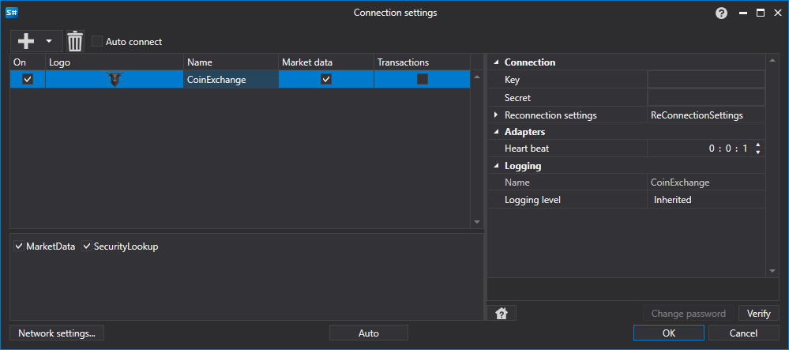

> [!WARNING]
> この取引所は完全に閉鎖されています（2019年10月 - 閉鎖）。このコネクターは現在動作しません。ドキュメントは履歴参照用として保存されています。

# CoinExchange のグラフィカル設定

すべての [S#](../../../../api.md) 製品では、接続のグラフィカル設定は [?????????](../../../graphical_user_interface/connection_settings_window.md) で行います。

- **Key** - キー。
- **Secret** - シークレット。
- **Heart beat** - 接続が稼働していることを追跡するためのサーバーチェック間隔。デフォルトでは 1 分です。
- **Reconnection settings** - 取引システムとの接続を追跡するための設定メカニズム。([Reconnection settings](../../reconnection_settings.md))

## 推奨コンテンツ

[コネクター](../../../connectors.md)

[グラフィカル設定](../../graphical_configuration.md)

[独自コネクターの作成](../../creating_own_connector.md)

[設定の保存と読み込み](../../save_and_load_settings.md)
