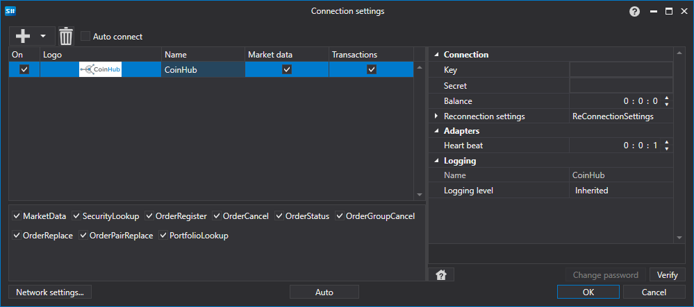

# CoinHub のグラフィカル設定

すべての [S#](../../../../api.md) 製品では、接続のグラフィカル設定は [接続設定ウィンドウ](../../../graphical_user_interface/connection_settings_window.md) で行います。

- **Key** - キー。
- **Secret** - シークレット。
- **Balance** - 残高チェック間隔。入金および出金操作の場合に必要です。
- **ハートビート** - 接続が稼働していることを追跡するためのサーバーチェック間隔。デフォルトでは 1 分です。
- **再接続設定** - 取引システムとの接続を追跡するための設定メカニズム。([再接続設定](../../reconnection_settings.md))

## 推奨コンテンツ

[コネクター](../../../connectors.md)

[グラフィカル設定](../../graphical_configuration.md)

[独自コネクターの作成](../../creating_own_connector.md)

[設定の保存と読み込み](../../save_and_load_settings.md)
