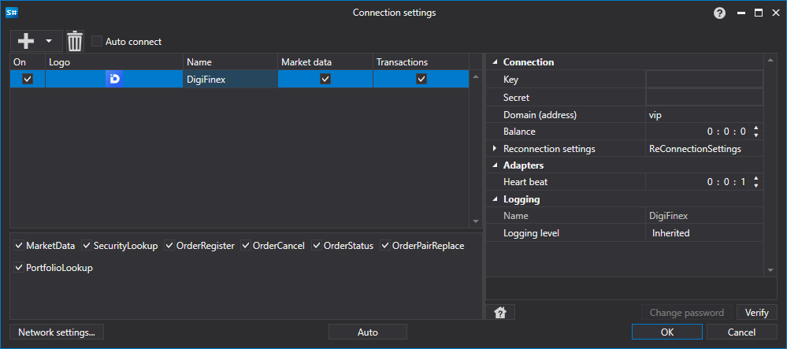

# DigiFinex のグラフィカル設定

すべての [S#](../../../../api.md) 製品では、接続のグラフィカル設定は [接続設定ウィンドウ](../../../graphical_user_interface/connection_settings_window.md) で行います。

- **キー** - Key。
- **シークレット** - Secret。
- **ドメイン（アドレス）** - ドメインアドレス。
- **残高** - 残高確認間隔。入金および出金操作を行う場合に必要です。
- **ハートビート** - 接続が稼働していることを追跡するためのサーバー確認間隔。デフォルトでは 1 分に等しくなります。
- **再接続設定** - 取引システム設定との接続を追跡するためのメカニズム。([再接続設定](../../reconnection_settings.md))

## 推奨コンテンツ

[コネクター](../../../connectors.md)

[グラフィカル設定](../../graphical_configuration.md)

[独自コネクターの作成](../../creating_own_connector.md)

[設定の保存と読み込み](../../save_and_load_settings.md)
