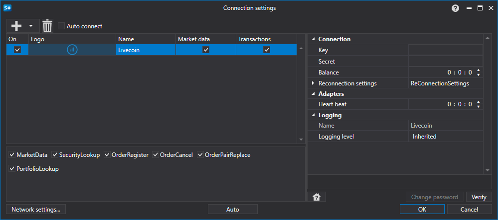

> [!WARNING]
> この取引所は恒久的に閉鎖されています（2020年12月 - ハッキングを受けて閉鎖）。このコネクターは現在動作しません。ドキュメントは履歴参照のために保存されています。

# Livecoin グラフィカル設定

すべての [S#](../../../../api.md) 製品では、接続のグラフィカル設定は [?????????](../../../graphical_user_interface/connection_settings_window.md) で行います。

- **Key** - Key。
- **Secret** - Secret。
- **Balance** - 残高確認間隔。入金および出金操作を行う場合に必要です。
- **Heart beat** - 接続が生きていることを追跡するためのサーバー確認間隔。既定では 1 分です。
- **Reconnection settings** - 取引システムとの接続を追跡するための設定メカニズム。([再接続設定](../../reconnection_settings.md))

## 推奨コンテンツ

[コネクター](../../../connectors.md)

[グラフィカル設定](../../graphical_configuration.md)

[独自コネクターの作成](../../creating_own_connector.md)

[設定の保存と読み込み](../../save_and_load_settings.md)

