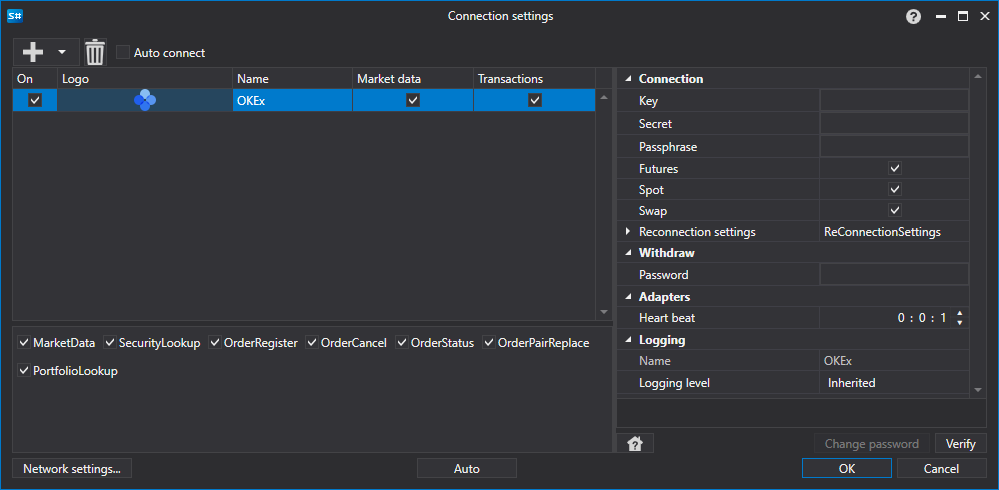

# OKEx のグラフィカル設定

すべての [S#](../../../../api.md) 製品では、接続のグラフィカル設定は [接続設定ウィンドウ](../../../graphical_user_interface/connection_settings_window.md) で行います。

- **Key** - キー。
- **Secret** - シークレット。
- **Passphrase** - パスフレーズ。
- **Futures** - Futures セクション
- **Spot** - Spot セクション
- **Swap** - Swap セクション。
- **Password** - 管理パスワード。
- **Heart beat** - 接続が有効であることを追跡するためのサーバーチェック間隔。デフォルトでは 1 分です。
- **Reconnection settings** - 取引システム設定との接続を追跡するためのメカニズム。([再接続設定](../../reconnection_settings.md))

## 推奨コンテンツ

[コネクタ](../../../connectors.md)

[グラフィカル設定](../../graphical_configuration.md)

[独自コネクタの作成](../../creating_own_connector.md)

[設定の保存と読み込み](../../save_and_load_settings.md)
