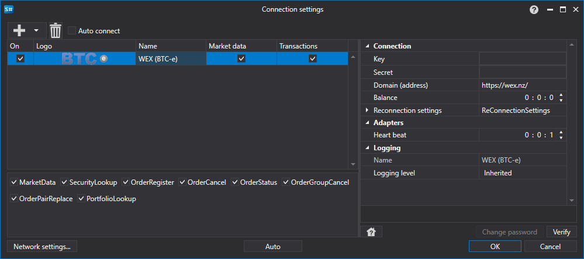

> [!WARNING]
> この取引所は完全に閉鎖されています（2017年7月に差し押さえ）。このコネクタは現在動作しません。ドキュメントは履歴参照用に保持されています。

# WEX (BTC-e) のグラフィカル設定

すべての [S#](../../../../api.md) 製品では、接続のグラフィカル設定は [接続設定ウィンドウ](../../../graphical_user_interface/connection_settings_window.md) で行います。

- **Key** - キー。
- **Secret** - シークレット。
- **Domain (address)** - ドメインアドレス。
- **Balance** - 残高確認間隔。入金および出金操作を行う場合に必要です。
- **ハートビート** - 接続が生きていることを追跡するためのサーバーチェック間隔。既定では 1 分です。
- **再接続設定** - 取引システム設定との接続を追跡するためのメカニズム。([再接続設定](../../reconnection_settings.md))

## 推奨コンテンツ

[コネクタ](../../../connectors.md)

[グラフィカル設定](../../graphical_configuration.md)

[独自コネクタの作成](../../creating_own_connector.md)

[設定の保存と読み込み](../../save_and_load_settings.md)
