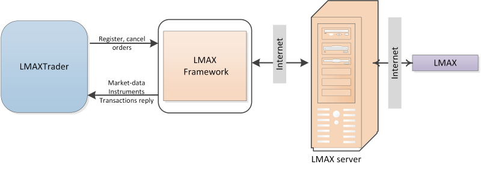

# LMAX の設定

相互作用のメカニズムを次の図に示します。 

コネクタを使用するには、**Login** と **Password** を指定する必要があります。**Login** と **Password** はブローカーから提供されます。API アクセスを取得するには、ブローカーに問い合わせることをお勧めします。

## 関連項目

[接続設定ウィンドウ](../../../graphical_user_interface/connection_settings_window.md)
