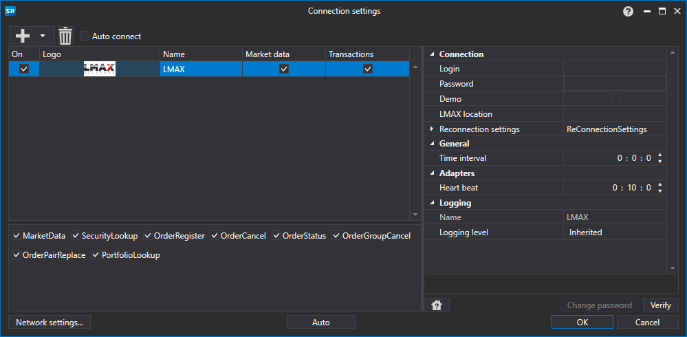

# LMAX のグラフィカル設定

すべての [S#](../../../../api.md) 製品では、接続のグラフィカル設定は [接続設定ウィンドウ](../../../graphical_user_interface/connection_settings_window.md) で行います。

- **ログイン** - ログインです。
- **パスワード** - パスワードです。
- **デモ** - 実際の取引サーバーではなくデモ取引に接続します。
- **LMAX location** - LMAX 取引所のロケーションです。
- **ハートビート** - 接続が維持されていることを追跡するためのサーバーチェック間隔です。既定では 1 分です。
- **再接続設定** - 取引システム設定を使用して接続を追跡するためのメカニズムです。([再接続設定](../../reconnection_settings.md))

## 推奨コンテンツ

[コネクタ](../../../connectors.md)

[グラフィカル設定](../../graphical_configuration.md)

[独自コネクタの作成](../../creating_own_connector.md)

[設定の保存と読み込み](../../save_and_load_settings.md)
