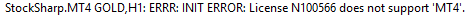

# MetaTrader

[StockSharp](../../../api.md) は、特別なコネクタを通じて MT4 および MT5 ターミナルと連携します。これらのコネクタをインストールするには、[インストーラー](../../../installer.md) を使用します（詳細については、[プログラムのインストールと削除](../../../installer/install_and_remove_apps.md)を参照してください）。

どちらのコネクタも同じ方法で使用するため、以下では MT5 への接続プロセスについて説明します。

## MT コネクタの設定

> [!Video https://www.youtube.com/embed/qGnIa7YIS5Q]

1. [インストーラー](../../../installer.md) で MT コネクタを選択し、インストールプロセスを開始します。

   

2. [インストーラー](../../../installer.md) は、コネクタをどのフォルダーにインストールするかを尋ねます（Experts フォルダーにインストールする必要があります）。

   

3. 複数のターミナルがインストールされている場合は、コネクタをインストールする対象を選択する必要があります。

   

4. 目的のターミナルを選択すると、Experts フォルダーへのパスが表示されます。

   

   > [!TIP]
   > - パスを自動的に判定できない場合は、ディレクトリ検索で *C:\\Users\\%your_user_name%\\AppData\\Roaming\\MetaQuotes\\Terminal\\%many_letters_and_numbers%\\MQL4\\Experts\\* を手動で選択する必要があります（MT5 の場合、パスには MQL5 が含まれます）。

5. インストールを完了し、終了するまで待ちます。インストールの最後に、[インストーラー](../../../installer.md) はターミナルを設定する必要があることを警告します。これを行うには、MT ターミナルを起動して取引に接続します。
6. ツール -> オプション メニューで **エキスパートアドバイザー** タブを選択し、外部 DLL 取引の許可（**DLL インポートを許可**）が有効になっていることを確認します。
7. コネクタのインストール中（手順 2）にターミナルが実行されていた場合は、エキスパートを右クリックし、メニューから **更新** を選択してエキスパートのリストを更新する必要があります。

   

8. S# エキスパートを選択し、右クリックしてメニューから **チャートに追加** を選択します。

   

9. 設定ウィンドウが表示され、ログインとパスワード（匿名認証は既定で有効）および接続アドレスを設定できます（一度に複数のターミナルへ接続する場合、アドレスには一意のポートを含める必要があります）。
10. チャートの右上隅（最初に見つかったもの）にスマイリーアイコンが表示されるはずです。

    

    また、エキスパートのログウィンドウには、スクリプトが正常に起動したこと、およびインストゥルメント数に関する情報が表示されるはずです。
11. MT4 または MT5 のライセンスが取得されていない場合、次のような行がログに表示されます。

    

12. MT への接続は FIX プロトコルを通じて行われ、[FIX プロトコル](../common/fix_protocol.md)コネクタを使用します。デモンストレーションには [Terminal](../../../terminal.md) プログラムを使用しました。以下は、トランザクション接続とマーケットデータ接続の設定です（MT5 の場合、既定のポートは 23000 ではなく 23001 です）。

    

    同様の設定を [Designer](../../../designer.md)、[Hydra](../../../hydra.md)、または任意の API プログラムで行う必要があります。

    匿名認証（前の項目）の場合、ログインとパスワードは空のままにします。複数のロボットで MT に接続する場合は、異なる接続を識別するために一意のログインを指定する必要があります。

    > [!TIP]
    > - StockSharp を MetaTrader に接続する前にスクリプトを起動し、この接続が必要な間は実行し続ける必要があります。  
    > - StockSharp で過去のローソク足を表示するには、MetaTrader サーバーからダウンロードする必要があります。方法については、MetaTrader のドキュメントを参照してください。

    接続に成功した場合、例にはインストゥルメントと口座のリストが表示されるはずです。

    

13. エラーが発生した場合、コネクタのログは保持され、**Experts\\StockSharp\\Data\\Log** フォルダーで利用できます。

    
