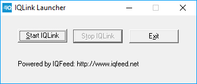

# IQFeed

**DTN IQFeed** - 株価、外国為替、ニュース、先物契約などのリアルタイム市場データプロバイダーです。

現在の取引プラットフォーム向けの取引ロボットの作成を開始する前に、[コネクター](../../connectors.md) のリンクを読むことをお勧めします。 

## IQFeed の設定

相互作用のメカニズムは次の図に示されています。 

**IQFeed** コネクターを使用するには、コンピューターに **IQ Feed Client** ルーターをインストールする必要があります。これはローカルコンピューターにもリモートコンピューターにもインストールできます。クライアントアプリケーションと **IQ Feed Client** の間、および **IQ Feed Client** とサーバーの間のデータ交換は、TCP\/IP プロトコルで行われます。 

[IQFeed](https://www.iqfeed.net/stocksharp/) サイトから **IQ Feed Client** をダウンロードするには、まず **iQFeed** から受け取ったパスワードとログインを使用して認証する必要があります。

**IQ Feed Client** をインストールした後は、コンピューターを再起動することをお勧めします。

**IQ Feed Client, IQLink Launcher** をインストールした後は、起動する必要があります。

開いた **IQLink Launcher** ウィンドウで、**Start IQLink** をクリックします。

開いた **IQ Connect Login** ウィンドウで、**iQFeed** サービスから受け取った **ログイン** と **パスワード** (または PIN) を入力します。これらの認証情報は、**iQFeed** Web サイトのログインとパスワードとは同じではありません。認証情報を入力した後、**Connect** をクリックします。

データを受信するために、クライアントアプリケーションは異なるポートを介した 4 つの接続を使用します。 

1. Level1 (port 5009) は、銘柄のリアルタイムデータ (ティック、始値と終値、ボラティリティなど) およびニュースを取得するために使用されます。
2. Level2 (port 9200) は、銘柄の拡張気配を取得するために使用され、各 ECN について最良の気配ペアを取得できます。
3. Lookup (port 9100) は、銘柄の検索、履歴データの取得、ニュースに関する詳細情報の取得に使用されます。
4. Admin (port 9300) は、接続に関する一般情報の取得および設定の変更に使用されます。

**IQ Feed Client** への接続に既定で使用されるポート番号は括弧内に示されています。クライアント接続については、ポート番号をレジストリで変更できます。たとえば Level1 の場合、次のパスです: \[HKEY\_CURRENT\_USER\\SOFTWARE\\DTN\\IQFEED\\Startup\\Level1Port\]。IQ サーバーへの接続に使用するポート番号は変更できません。 

> [!CAUTION]
> コネクターは市場データフィードのみをサポートしており、トランザクションはサポートされていません。 

## 推奨コンテンツ

[コネクター](../../connectors.md)

[グラフィカル設定](../graphical_configuration.md)

[設定の保存と読み込み](../save_and_load_settings.md)

[独自コネクターの作成](../creating_own_connector.md)

[注文管理](../../orders_management.md)

[新規注文の作成](../../orders_management/create_new_order.md)

[新規ストップ注文の作成](../../orders_management/create_new_stop_order.md)

[IQFeed の接続](iqfeed/connection_iqfeed.md)

[IQFeed アダプターの初期化](iqfeed/adapter_initialization_iqfeed.md)
