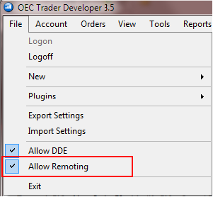

# ターミナルとアルゴリズムの同時動作

必要に応じて、OEC Trader ターミナルを [Primary](xref:StockSharp.OpenECry.OpenECryRemoting.Primary) モードで動作するように設定し、その後アルゴリズム [S#](../../../../api.md) を [Primary](xref:StockSharp.OpenECry.OpenECryRemoting.Primary) モードで実行できます。この場合、ターミナルとアルゴリズムは OEC サーバーへの同じ接続を使用します。これを設定するには、OEC Trader ターミナルでメニュー項目 **ファイル → リモート操作を許可** をチェックする必要があります。

