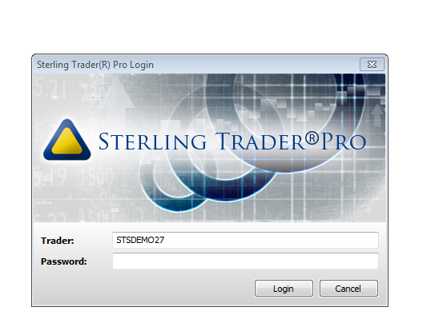

# Sterling の構成

**Sterling** コネクターを使用するには、接続を行うコンピューターに直接インストールされたローカルの **Sterling Trader Pro** ターミナルを使用する必要があります。**Sterling Trader Pro** に接続するには、**Login** と **Password** を指定する必要があります。

**Sterling Trader Pro、Login、Password** およびサーバーアドレスはブローカーから提供されます。API アクセスを取得するには、ブローカーに問い合わせることをお勧めします。

> [!TIP]
> Sterling API を正しく動作させるには、Visual Studio を管理者として実行する必要があります。

