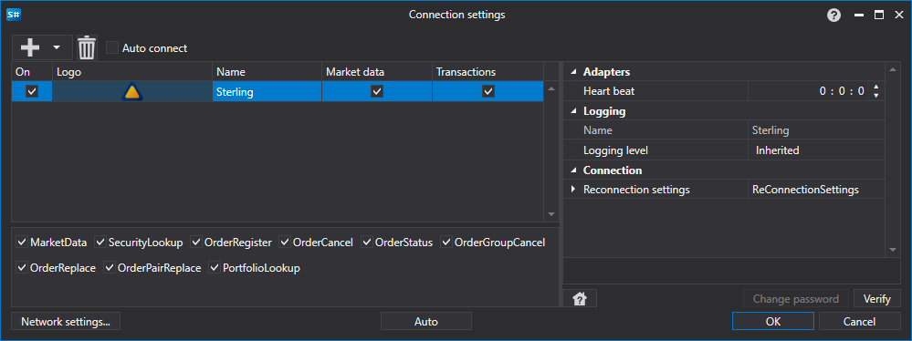

# Sterling のグラフィカル構成

すべての [S#](../../../../api.md) 製品では、接続のグラフィカル構成は [接続設定ウィンドウ](../../../graphical_user_interface/connection_settings_window.md) で行います。

- **Heart beat** - 接続が有効であることを追跡するためのサーバーチェック間隔です。既定では 1 分です。
- **Reconnection settings** - 取引システム設定との接続を追跡するためのメカニズムです。([再接続設定](../../reconnection_settings.md))

## 推奨コンテンツ

[コネクター](../../../connectors.md)

[グラフィカル構成](../../graphical_configuration.md)

[独自コネクターの作成](../../creating_own_connector.md)

[設定の保存と読み込み](../../save_and_load_settings.md)

