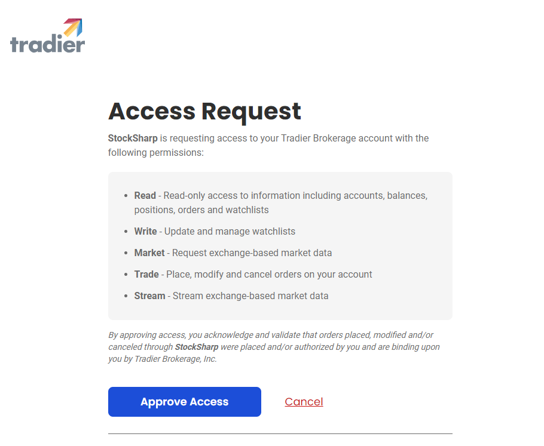

# Tradier のグラフィカル構成

すべての StockSharp 製品では、接続のグラフィカル設定は [接続設定ウィンドウ](../../../graphical_user_interface/connection_settings_window.md) 画面フォームで行います。

- **トークン** - 認証トークンです。
- **デモ** - デモモードです。

OAuth 認可:

1. トークンを "Token" フィールドに直接挿入できます。
2. トークンフィールドを空のままにし、"Demo" モードが選択されていない場合は、OAuth 認可が使用されます。

OAuth 認可プロセス:

1. "Check" ボタンをクリックすると、ウィンドウが開きます。

   

2. "Start" をクリックすると、ユーザーはログインのため Tradier Web サイトにリダイレクトされます。

   

3. Tradier Web サイトで、StockSharp アプリケーションに取引操作へのアクセスを許可する必要があります。

   

4. その後、StockSharp Web サイトにリダイレクトされ、プログラムは自動的にログインします。

## 関連項目

[コネクター](../../../connectors.md)

[OAuth](../../oauth.md)

[グラフィカル構成](../../graphical_configuration.md)

[独自コネクターの作成](../../creating_own_connector.md)

[設定の保存と読み込み](../../save_and_load_settings.md)

