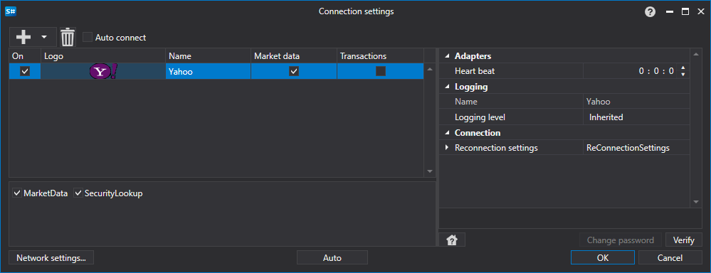

# Yahoo のグラフィカル設定

すべての [S#](../../../../api.md) 製品では、接続のグラフィカル設定は [?????????](../../../graphical_user_interface/connection_settings_window.md) で実行します。

- **Heart beat** - 接続が生きていることを追跡するためのサーバーチェック間隔です。既定では 1 分です。
- **Reconnection settings** - 取引システムとの接続を設定に従って追跡するためのメカニズムです。([再接続設定](../../reconnection_settings.md))

## 推奨コンテンツ

[コネクター](../../../connectors.md)

[グラフィカル設定](../../graphical_configuration.md)

[独自コネクターの作成](../../creating_own_connector.md)

[設定の保存と読み込み](../../save_and_load_settings.md)

