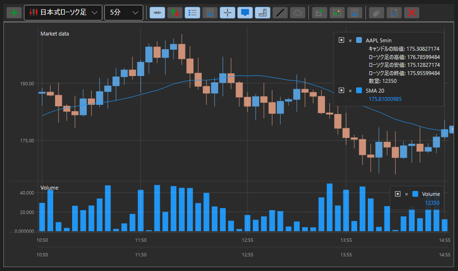

# チャート

[S#](../../api.md) は、チャート作成のための便利なコンポーネントを提供します。これらのコンポーネントは [StockSharp.Xaml.Charting](xref:StockSharp.Xaml.Charting) 名前空間にまとめられています。

グラフィックスライブラリにおける重要な概念は、*chart* という考え方です。*chart* は、チャートを構築する際に使用される他の要素のコンテナーです。[S#](../../api.md) には、いくつかの種類の *charts* があります。

- [Chart](xref:StockSharp.Xaml.Charting.Chart) - 株価チャートを表示するためのグラフィカルコンポーネント。
- [ChartPanel](xref:StockSharp.Xaml.Charting.ChartPanel) - 株価チャートを表示するための高度なグラフィカルコンポーネント。
- [EquityCurveChart](xref:StockSharp.Xaml.Charting.EquityCurveChart) - エクイティカーブを表示するためのグラフィカルコンポーネント。
- [ボックスチャート](charts/box_chart.md) - 出来高を数値のグリッドとして表すチャート。
- [クラスターチャート](charts/cluster_chart.md) - 出来高をヒストグラム付きのクラスターとして表示するチャート。
- [OptionPositionChart](xref:StockSharp.Xaml.Charting.OptionPositionChart) - 原資産に対するオプションポジションと「Greeks」を表示するグラフィカルコンポーネント。[ポジションチャート](options/position_chart.md) を参照してください。

さらに、[S#](../../api.md) には出来高分析用の 2 種類のチャート、[ボックスチャート](charts/box_chart.md)と[クラスターチャート](charts/cluster_chart.md)が含まれています。

次の図は、グラフィカルコンポーネントの主要な要素を示しています。

## グラフィカルコンポーネントの要素

## IChart

[IChart](xref:StockSharp.Charting.IChart) は、すべての種類のチャートの基本インターフェイスです。このインターフェイスには、「子」要素を追加および削除するためのメソッド、コンポーネントの外観と描画方法をカスタマイズするためのプロパティ、そしてチャート自体を描画するためのメソッドが含まれます。*chart* は、描画用に複数の領域（[IChartArea](xref:StockSharp.Charting.IChartArea)）を含むことができます（図を参照）。[Chart](xref:StockSharp.Xaml.Charting.Chart) には、*OverView* プレビュー領域も含まれます（図を参照）。この領域では、スライダーを使用してチャートの表示範囲を選択できます。さらに、[IChartArea](xref:StockSharp.Charting.IChartArea)、X 軸、およびマウスホイールのドラッグを使用して、チャートをスクロールおよびズームできます。

**[IChart](xref:StockSharp.Charting.IChart) の主要なプロパティとメソッド**

- [IChart.Areas](xref:StockSharp.Charting.IChart.Areas) - [IChartArea](xref:StockSharp.Charting.IChartArea) 領域のリスト。
- [IThemeableChart.ChartTheme](xref:StockSharp.Charting.IThemeableChart.ChartTheme) - コンポーネントのテーマ。
- [IChart.IndicatorTypes](xref:StockSharp.Charting.IChart.IndicatorTypes) - チャートに表示できるインジケーターのリスト。
- [IChart.CrossHair](xref:StockSharp.Charting.IChart.CrossHair) - 十字カーソル表示の有効化/無効化。
- [IChart.CrossHairAxisLabels](xref:StockSharp.Charting.IChart.CrossHairAxisLabels) - 十字カーソル位置での軸ラベル表示の有効化/無効化。
- [IChart.IsAutoRange](xref:StockSharp.Charting.IChart.IsAutoRange) - X 軸の自動スケーリングの有効化/無効化。
- [IChart.IsAutoScroll](xref:StockSharp.Charting.IChart.IsAutoScroll) - X 軸の自動スクロールの有効化/無効化。
- [IChart.ShowLegend](xref:StockSharp.Charting.IChart.ShowLegend) - 凡例表示の有効化/無効化。
- [IChart.ShowOverview](xref:StockSharp.Charting.IChart.ShowOverview) - *OverView* プレビュー領域表示の有効化/無効化。
- [IChart.AddArea](xref:StockSharp.Charting.IChart.AddArea(StockSharp.Charting.IChartArea)) - [IChartArea](xref:StockSharp.Charting.IChartArea) を追加します。
- [IChart.AddElement](xref:StockSharp.Charting.IChart.AddElement(StockSharp.Charting.IChartArea, StockSharp.Charting.IChartElement)) - データ系列要素を追加します。複数のオーバーロードがあります。
- [IChart.Reset](xref:StockSharp.Charting.IChart.Reset(System.Collections.Generic.IEnumerable{StockSharp.Charting.IChartElement})) - 以前に描画された値を「リセット」します。
- [IChart.Draw](xref:StockSharp.Charting.IThemeableChart.Draw(StockSharp.Charting.IChartDrawData)) - チャート上に値を描画します。
- [IChart.OrderCreationMode](xref:StockSharp.Charting.IChart.OrderCreationMode) - 注文作成モードです。設定するとチャートから注文を作成できます。既定ではオフです。

## IChartArea

[IChartArea](xref:StockSharp.Charting.IChartArea) - チャート描画領域です。チャート上に描画される [IChartElement](xref:StockSharp.Charting.IChartElement)（インジケーター、キャンドルなど）と、チャート軸（[IChartAxis](xref:StockSharp.Charting.IChartAxis)）のコンテナーとして機能します。

**[IChartArea](xref:StockSharp.Charting.IChartArea) の主要なプロパティ**

- [IChartArea.Elements](xref:StockSharp.Charting.IChartArea.Elements) - [IChartElement](xref:StockSharp.Charting.IChartElement) のリスト。
- [IChartArea.XAxises](xref:StockSharp.Charting.IChartArea.XAxises) - 水平軸のリスト。
- [IChartArea.YAxises](xref:StockSharp.Charting.IChartArea.YAxises) - 垂直軸のリスト。

## IChartElement

チャートに表示されるすべての要素は、[IChartElement](xref:StockSharp.Charting.IChartElement) インターフェイスを実装する必要があります。[S#](../../api.md) では、次のクラスがこのインターフェイスを実装しています。

- [ChartCandleElement](xref:StockSharp.Xaml.Charting.ChartCandleElement) - キャンドルを表示するための要素。
- [ChartIndicatorElement](xref:StockSharp.Xaml.Charting.ChartIndicatorElement) - インジケーターを表示するための要素。
- [ChartOrderElement](xref:StockSharp.Xaml.Charting.ChartOrderElement) - 注文を表示するための要素。
- [ChartTradeElement](xref:StockSharp.Xaml.Charting.ChartTradeElement) - 約定を表示するための要素。

視覚要素のクラスには、チャートの外観を調整するための複数のプロパティがあります。色、線の太さ、要素のスタイルを調整できます。たとえば、[IChartCandleElement.DrawStyle](xref:StockSharp.Charting.IChartCandleElement.DrawStyle) プロパティを使用すると、キャンドルの外観（キャンドルまたはバー）を変更できます。[ChartIndicatorElement.DrawStyle](xref:StockSharp.Xaml.Charting.ChartIndicatorElement.DrawStyle) プロパティを使用すると、インジケーター線のスタイルを設定できます。インジケーターをヒストグラムとして表示するには、[DrawStyles.Histogram](xref:Ecng.Drawing.DrawStyles.Histogram) 値を使用します。[ChartCandleElement.ShowAxisMarker](xref:StockSharp.Xaml.Charting.ChartCandleElement.ShowAxisMarker) および [ChartIndicatorElement.ShowAxisMarker](xref:StockSharp.Xaml.Charting.ChartIndicatorElement.ShowAxisMarker) プロパティでは、チャートの軸上のマーカー（図を参照）の表示をオン/オフできます。

## 関連項目

- [ローソク足チャート](charts/candle_chart.md)
- [チャートパネル](charts/candle_chart_panel.md)
- [エクイティカーブチャート](charts/equity_curve_chart.md)
- [ボックスチャート](charts/box_chart.md)
- [クラスター](charts/cluster_chart.md)
