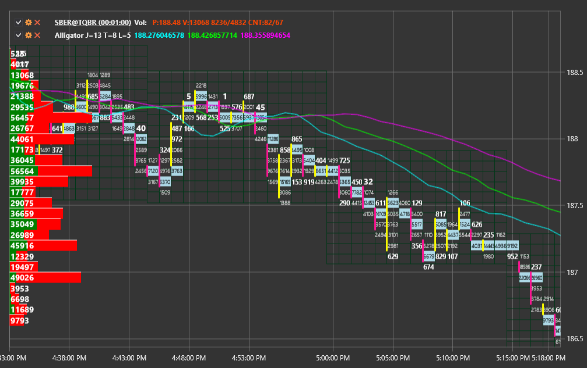

# ボックスチャート

BoxChart は、出来高を数値グリッドの形式で表示するための特殊な種類のチャートです。このチャートタイプを使用するには、特別なスタイル [ChartCandleElement.DrawStyle](xref:StockSharp.Xaml.Charting.ChartCandleElement.DrawStyle) \= [ChartCandleDrawStyles.BoxVolume](xref:StockSharp.Charting.ChartCandleDrawStyles.BoxVolume) を設定する必要があります。このチャートは、[PriceLevels](xref:StockSharp.Messages.CandleMessage.PriceLevels) プロパティの情報をソースデータとして使用します。

**主なプロパティ**

- [ChartCandleElement.Timeframe2Multiplier](xref:StockSharp.Xaml.Charting.ChartCandleElement.Timeframe2Multiplier) - コンストラクターで指定されたメイン時間枠に適用され、2 番目の時間枠を得るための倍率です。表示されるキャンドルは、2 番目の時間枠に対応するサイズのグループにまとめられます。グループは、それぞれの色のグリッドと枠でチャート上に描画されます。
- [ChartCandleElement.Timeframe3Multiplier](xref:StockSharp.Xaml.Charting.ChartCandleElement.Timeframe3Multiplier) - [ChartCandleElement.Timeframe2Multiplier](xref:StockSharp.Xaml.Charting.ChartCandleElement.Timeframe2Multiplier) と同様ですが、3 番目の時間枠用です。3 番目の時間枠は、対応する色のグリッドを使用してチャート上に描画されます。
- [ChartCandleElement.FontColor](xref:StockSharp.Xaml.Charting.ChartCandleElement.FontColor) - チャート上の出来高値の色です。
- [ChartCandleElement.MaxVolumeColor](xref:StockSharp.Xaml.Charting.ChartCandleElement.MaxVolumeColor) - 指定されたキャンドル内の最大出来高について、チャート上に表示される出来高値の色です。
- [ChartCandleElement.Timeframe2Color](xref:StockSharp.Xaml.Charting.ChartCandleElement.Timeframe2Color) - 2 番目の時間枠のグリッド色です。
- [ChartCandleElement.Timeframe2FrameColor](xref:StockSharp.Xaml.Charting.ChartCandleElement.Timeframe2FrameColor) - 2 番目の時間枠の枠色です。
- [ChartCandleElement.Timeframe3Color](xref:StockSharp.Xaml.Charting.ChartCandleElement.Timeframe3Color) - 3 番目の時間枠のグリッド色です。

この種類のチャートの使用例は *Samples\/Common\/SampleChart* にあります。

> [!TIP]
> チャートタイプを切り替えるには、チャートの左上隅にある設定ボタン（歯車）を使用します。

