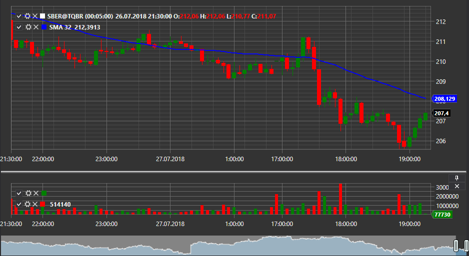

# ローソク足チャート

[Chart](xref:StockSharp.Xaml.Charting.Chart) は、ローソク足、インジケーター、およびチャート上の注文と約定マーカーの表示といった株価チャートを構築できるグラフィカルコンポーネントです。

以下は、[Chart](xref:StockSharp.Xaml.Charting.Chart) コンポーネントを使用してチャートを構築する例です。この例は Samples\/02\_Candles\/01\_Realtime をベースにし、一部変更を加えています。



## Chart を使用したチャート構築の例

1. XAML でウィンドウを作成し、[Chart](xref:StockSharp.Xaml.Charting.Chart) グラフィカルコンポーネントを追加します。コンポーネントに **Chart** という名前を割り当てます。ウィンドウを作成するときは、名前空間 *http:\/\/schemas.stocksharp.com\/xaml* を追加する必要があることに注意してください。

   ```xaml
   <Window x:Class="SampleCandles.ChartWindow"
           xmlns="http://schemas.microsoft.com/winfx/2006/xaml/presentation"
           xmlns:x="http://schemas.microsoft.com/winfx/2006/xaml"
           xmlns:charting="http://schemas.stocksharp.com/xaml"
           Title="ChartWindow" Height="300" Width="300">
      <charting:Chart x:Name="Chart" x:FieldModifier="public" />
   </Window>
   ```

2. メインウィンドウのコードで、チャート領域、チャート要素、インジケーター、サブスクリプション用の変数を宣言します。

   ```cs
   private readonly Dictionary<Subscription, ChartWindow> _chartWindows = new Dictionary<Subscription, ChartWindow>();
   private readonly Connector _connector = new Connector();
   private readonly LogManager _logManager;
   private ChartArea _candlesArea;
   private ChartArea _indicatorsArea;
   private ChartIndicatorElement _smaChartElement;
   private ChartIndicatorElement _macdChartElement;
   private ChartCandleElement _candlesElem;
   private SimpleMovingAverage _sma;
   private MovingAverageConvergenceDivergence _macd;
   ```

3. **Connect** ボタンの **Click** イベントハンドラーで、コネクターイベントの購読および [IConnector.Connect](xref:StockSharp.BusinessEntities.IConnector.Connect) メソッドの呼び出しと併せて、[Connector.CandleReceived](xref:StockSharp.Algo.Connector.CandleReceived) イベントを購読します。このイベントハンドラーでは、新しいキャンドルを受信したときにチャートが描画されます。

   ```cs
   private void ConnectClick(object sender, RoutedEventArgs e)
   {
       _connector.CandleReceived += OnCandleReceived;
       
       // その他の必要なイベントを購読
       _connector.Connected += () => this.GuiAsync(() => { /* 接続を処理 */ });
       _connector.Disconnected += () => this.GuiAsync(() => { /* 切断を処理 */ });
       
       // 取引システムへ接続
       _connector.Connect();
   }
   ```

4. **ShowChart** ボタンのハンドラーで、インジケーターオブジェクト、領域、チャート要素を作成します。要素を領域に追加し、領域をチャートに追加します。チャートウィンドウを開き、キャンドルへのサブスクリプションを開始します。

   ```cs
   private void ShowChartClick(object sender, RoutedEventArgs e)
   {
       var security = SelectedSecurity;
       
       // キャンドルへのサブスクリプションを作成
       var subscription = new Subscription(
           DataType.TimeFrame(TimeSpan.FromMinutes(5)),
           security)
       {
           MarketData = 
           {
               // 30 日分の履歴データをリクエスト
               From = DateTime.Today.Subtract(TimeSpan.FromDays(30)),
               To = DateTime.Now,
               // 完了したキャンドルのみを取得
               IsFinishedOnly = true
           }
       };
       
       // チャートウィンドウを作成
       _chartWindows.SafeAdd(subscription, key =>
       {
           var wnd = new ChartWindow
           {
               Title = $"{security.Code} {TimeSpan.FromMinutes(5)}"
           };
           wnd.MakeHideable();
           
           // インジケーターを初期化
           _sma = new SimpleMovingAverage() { Length = 11 };
           _macd = new MovingAverageConvergenceDivergence();
           
           // チャート要素を初期化
           _smaChartElement = new ChartIndicatorElement();
           _macdChartElement = new ChartIndicatorElement();
           _candlesElem = new ChartCandleElement();
           
           // MACD の表示スタイルをヒストグラムに設定
           _macdChartElement.DrawStyle = DrawStyles.Histogram;
           
           // チャート領域を初期化
           _candlesArea = new ChartArea();
           _indicatorsArea = new ChartArea();
           
           // 領域をチャートに追加
           wnd.Chart.Areas.Add(_candlesArea);
           wnd.Chart.Areas.Add(_indicatorsArea);
           
           // 要素を領域に追加
           _candlesArea.Elements.Add(_candlesElem);
           _candlesArea.Elements.Add(_smaChartElement);
           _indicatorsArea.Elements.Add(_macdChartElement);
           
           // 自動描画のためにチャート要素をサブスクリプションへバインド
           wnd.Chart.AddElement(_candlesArea, _candlesElem, subscription);
           wnd.Chart.AddElement(_candlesArea, _smaChartElement, subscription);
           wnd.Chart.AddElement(_indicatorsArea, _macdChartElement, subscription);
           
           return wnd;
       }).Show();
       
       // キャンドルへのサブスクリプションを開始
       _connector.Subscribe(subscription);
   }
   ```

5. [Connector.CandleReceived](xref:StockSharp.Algo.Connector.CandleReceived) イベントハンドラーで、完了した各キャンドルについてキャンドルとインジケーター値を描画します。

   ```cs
   private void OnCandleReceived(Subscription subscription, ICandleMessage candle)
   {
       var wnd = _chartWindows.TryGetValue(subscription);
       if (wnd == null)
           return;
       
       // 完了したキャンドルのみを処理
       if (candle.State != CandleStates.Finished)
           return;
       
       // インジケーター値を計算
       var smaValue = _sma.Process(candle);
       var macdValue = _macd.Process(candle);
       
       // 描画用データを作成
       var data = new ChartDrawData();
       data
           .Group(candle.OpenTime)
               .Add(_candlesElem, candle)
               .Add(_smaChartElement, smaValue)
               .Add(_macdChartElement, macdValue);
       
       // ユーザーインターフェイススレッドでチャート上にデータを描画
       this.GuiAsync(() => wnd.Chart.Draw(data));
   }
   ```

## 自動チャート描画の例

StockSharp の最新バージョン以降では、Draw メソッドを明示的に呼び出すことなく自動チャート描画を設定できます。そのためには、Chart の設定時に AddElement メソッドを使用し、チャート要素をサブスクリプションにリンクします。

```cs
private void SetupAutoDrawingChart()
{
	var security = SelectedSecurity;
	
	// チャート要素を作成
	var candleElement = new ChartCandleElement();
	var smaElement = new ChartIndicatorElement { Title = "SMA" };
	
	// チャート領域を作成
	var area = new ChartArea();
	
	// 領域をチャートに追加
	Chart.Areas.Add(area);
	
	// キャンドルへのサブスクリプションを作成
	var subscription = new Subscription(
		DataType.TimeFrame(TimeSpan.FromMinutes(5)),
		security)
	{
		MarketData = 
		{
			From = DateTime.Today.Subtract(TimeSpan.FromDays(30)),
			To = DateTime.Now
		}
	};
	
	// 要素をチャート領域およびサブスクリプションへバインド
	Chart.AddElement(area, candleElement, subscription);
	Chart.AddElement(area, smaElement, subscription);
	
	// インジケーターを作成
	var sma = new SimpleMovingAverage { Length = 14 };
	
	// インジケーター処理のためにキャンドル受信イベントを購読
	_connector.CandleReceived += (sub, candle) => 
	{
		if (sub == subscription && candle.State == CandleStates.Finished)
		{
			// キャンドルをインジケーターで処理して値を取得
			var smaValue = sma.Process(candle);
			
			// インジケーター値を描画
			var data = new ChartDrawData();
			data
				.Group(candle.OpenTime)
					.Add(smaElement, smaValue);
			
			this.GuiAsync(() => Chart.Draw(data));
		}
	};
	
	// サブスクリプションを開始
	_connector.Subscribe(subscription);
}
```

## チャート上での注文と約定の表示

注文と約定のマーカーをチャート上に直接表示できます。

```cs
// 注文と約定を表示するための要素を作成
var orderElement = new ChartOrderElement();
var tradeElement = new ChartTradeElement();

// 要素をチャート領域に追加
_candlesArea.Elements.Add(orderElement);
_candlesArea.Elements.Add(tradeElement);

// 注文および約定の受信イベントを購読
_connector.OrderReceived += (sub, order) => 
{
	if (order.Security != _security)
		return;
	
	// 注文をチャート上に描画
	var data = new ChartDrawData();
	data.Group(order.Time).Add(orderElement, order);
	
	this.GuiAsync(() => Chart.Draw(data));
};

_connector.OwnTradeReceived += (sub, trade) => 
{
	if (trade.Order.Security != _security)
		return;
	
	// 約定をチャート上に描画
	var data = new ChartDrawData();
	data.Group(trade.Time).Add(tradeElement, trade);
	
	this.GuiAsync(() => Chart.Draw(data));
};
```

## チャートのクリア

チャートをクリアするには、Reset メソッドを使用できます。

```cs
// チャート全体をクリア
Chart.Reset();

// 特定の領域をクリア
_candlesArea.Reset();

// 特定の要素をクリア
_candlesElem.Reset();
```
