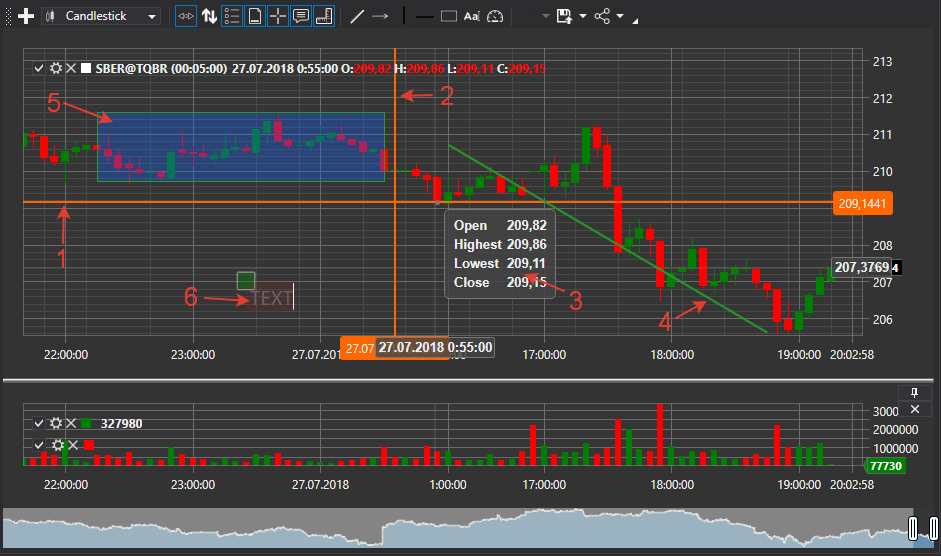
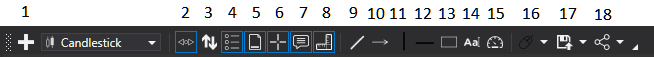

# ローソク足チャートパネル

[ChartPanel](xref:StockSharp.Xaml.Charting.ChartPanel) は、株価チャートを作成するための高度なコンポーネントで、ツールバーと追加機能を備えています。[ChartPanel](xref:StockSharp.Xaml.Charting.ChartPanel) によるチャート作成手法は、[Chart](candle_chart.md) の場合と大きく異なりません。

次の図は、コンポーネントの外観と、ツールバーボタンの機能を示しています。

1 - 水平線;

2 - 垂直線;

3 - プロンプト;

4 - トレンドライン;

5 - 領域;

6 - これはテキストです。

**ツールバー機能**

1 - パネルを追加;

2 - 自動スクロールを有効化;

3 - 自動スケーリングを有効化;

4 - 凡例を有効化;

5 - プレビュー領域を有効化;

6 - 十字カーソルを有効化;

7 - バーのプロンプトを有効化;

8 - 軸に値を表示;

9 - トレンドラインを描画;

10 - ポインターを描画;

11 - 垂直線を描画;

12 - 水平線を描画;

13 - 領域を選択;

14 - テキストラベル;

15 - FPS 統計を表示;

16 - 注文登録;

17 - データを保存;

18 - 公開;
