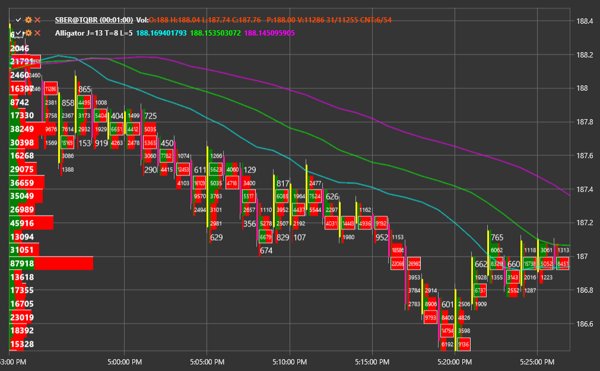

# クラスターチャート

ClusterChart は、棒グラフ付きのクラスター形式で出来高を表示するための特殊な種類のチャートです。この種類のチャートを使用するには、特殊なスタイル [IChartCandleElement.DrawStyle](xref:StockSharp.Charting.IChartCandleElement.DrawStyle) \= [ChartCandleDrawStyles.ClusterProfile](xref:StockSharp.Charting.ChartCandleDrawStyles.ClusterProfile) を設定する必要があります。このチャートは、ソースデータとして [PriceLevels](xref:StockSharp.Messages.CandleMessage.PriceLevels) プロパティの情報を使用します。

**主なプロパティ**

- [ChartCandleElement.ClusterLineColor](xref:StockSharp.Xaml.Charting.ChartCandleElement.ClusterLineColor) - 基本となるクラスター線の色。
- [ChartCandleElement.ClusterTextColor](xref:StockSharp.Xaml.Charting.ChartCandleElement.ClusterTextColor) - チャート上の出来高値の色。
- [ChartCandleElement.ClusterColor](xref:StockSharp.Xaml.Charting.ChartCandleElement.ClusterColor) - クラスターのヒストグラム内の主要なバーの色。
- [ChartCandleElement.ClusterMaxColor](xref:StockSharp.Xaml.Charting.ChartCandleElement.ClusterMaxColor) - クラスターのヒストグラム内の最大出来高バーの色。

この種類のチャートの使用例は、*Samples\/Common\/SampleChart* にあります。

> [!TIP]
> チャートの種類を切り替えるには、チャートの左上隅にある設定ボタン（歯車）を使用します。
