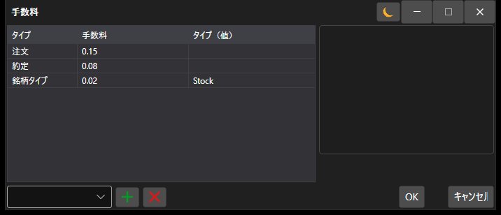

# 手数料設定ウィンドウ

[CommissionWindow](xref:StockSharp.Xaml.CommissionWindow) は、手数料を課金するルールを設定するための特殊なウィンドウです。



以下は、手数料を課金するルールを設定するウィンドウを呼び出すコード例です。

```cs
		private void RiskButton_OnClick(object sender, RoutedEventArgs e)
		{
			var wnd = new CommissionWindow();
			wnd.Rules.AddRange(Strategy.RiskManager.Rules.Select(r => r.Clone()));
			if (!wnd.ShowModal(this))
				return;
			Strategy.RiskManager.Rules.Clear();
			Strategy.RiskManager.Rules.AddRange(wnd.Rules);
		}
	  				
```
