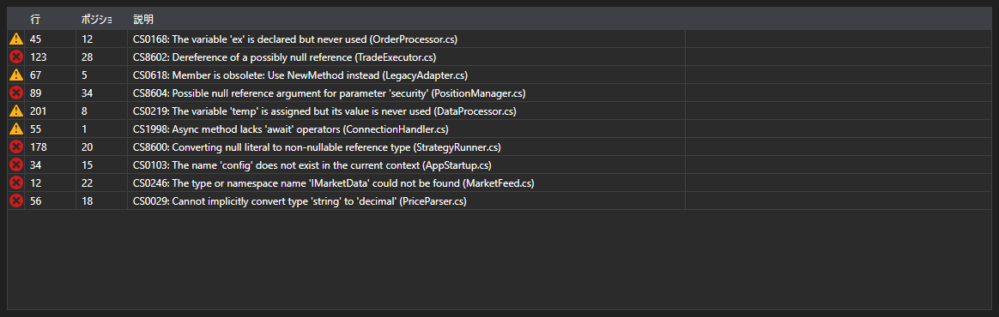

# コンパイルエラー



[ErrorsGrid](xref:StockSharp.Xaml.Code.ErrorsGrid) - コンパイルエラーのテーブルです。各 [CompilationError](xref:Ecng.Compilation.CompilationError) について種別 (エラー、警告、メッセージ)、行、行内の位置、本文を表示します。

**主なプロパティ**

- [ErrorsGrid.Errors](xref:StockSharp.Xaml.Code.ErrorsGrid.Errors) - コンパイルエラーの一覧。

行をダブルクリックすると `ErrorSelected` イベントが発生し、コードエディタがその行へカーソルを移動します。こうしてテーブルとエディタは「エラー一覧とエラー箇所へのジャンプ」という定番の組み合わせになります。

以下は使用例のコード断片です:

```xaml
<Window x:Class="Sample.CompilationWindow"
	xmlns="http://schemas.microsoft.com/winfx/2006/xaml/presentation"
	xmlns:x="http://schemas.microsoft.com/winfx/2006/xaml"
	xmlns:code="clr-namespace:StockSharp.Xaml.Code;assembly=StockSharp.Xaml"
	Height="200" Width="800">
	<code:ErrorsGrid x:Name="ErrorsGrid" />
</Window>
```

```cs
// コンパイル結果を表示します
var result = compiler.Compile("Strategy", sources, references);

ErrorsGrid.Errors.Clear();
ErrorsGrid.Errors.AddRange(result.Errors);

// ダブルクリックでエラーの行へ移動します
ErrorsGrid.ErrorSelected += error => CodePanel.Code.SelectLine(error.Line);
```

## 関連項目

[診断](../diagnostics.md)
