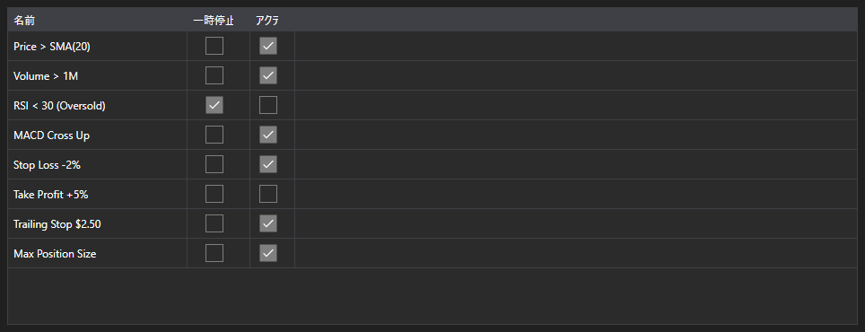

# 有効なルール



[MarketRuleGrid](xref:StockSharp.Xaml.MarketRuleGrid) - 戦略やコネクタが作成した [IMarketRule](xref:StockSharp.Algo.IMarketRule) ルールのテーブルです。ルール名、一時停止フラグ、有効フラグを表示します。

**主なプロパティ**

- [MarketRuleGrid.Rules](xref:StockSharp.Xaml.MarketRuleGrid.Rules) - ルールの一覧。通常は [Strategy.Rules](xref:StockSharp.Algo.Strategies.Strategy.Rules) です。

ルールが多く、どれがまだ生きているかを知りたい場面で役立ちます。ルールは発火して取り外されると一覧から消えるため、取り外されるはずなのに残っているルール、つまりリークがすぐに分かります。

以下は使用例のコード断片です:

```xaml
<Window x:Class="Sample.RulesWindow"
	xmlns="http://schemas.microsoft.com/winfx/2006/xaml/presentation"
	xmlns:x="http://schemas.microsoft.com/winfx/2006/xaml"
	xmlns:xaml="http://schemas.stocksharp.com/xaml"
	Height="300" Width="600">
	<xaml:MarketRuleGrid x:Name="RuleGrid" />
</Window>
```

```cs
// 戦略のルールを表示します
RuleGrid.Rules = _strategy.Rules;

// 作成されたルールはテーブルに現れます
_strategy
	.WhenPositionChanged()
	.Do(() => LogInfo("position={0}", _strategy.Position))
	.Apply(_strategy);
```

## 関連項目

[診断](../diagnostics.md)
