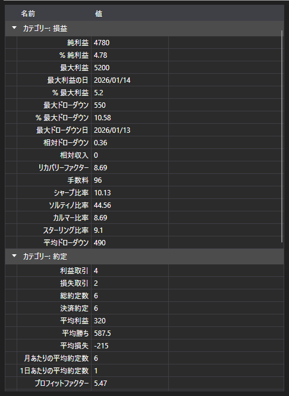

# 戦略の統計



[StatisticParameterGrid](xref:StockSharp.Xaml.StatisticParameterGrid) - 1 つの戦略の統計パラメーター [IStatisticParameter](xref:StockSharp.Algo.Statistics.IStatisticParameter) のテーブルです。パラメーターはカテゴリ (約定、注文、収益、ドローダウン) ごとにまとめられ、各行には名称、現在値、説明が並びます。

**主なプロパティとメソッド**

- [StatisticParameterGrid.StatisticManager](xref:StockSharp.Xaml.StatisticParameterGrid.StatisticManager) - テーブルが表示するパラメーターを持つ統計マネージャ。通常は [Strategy.StatisticManager](xref:StockSharp.Algo.Strategies.Strategy.StatisticManager) です。
- [StatisticParameterGrid.Parameters](xref:StockSharp.Xaml.StatisticParameterGrid.Parameters) - マネージャ経由ではなく直接指定する場合のパラメーターの一覧。
- [StatisticParameterGrid.Reset](xref:StockSharp.Xaml.StatisticParameterGrid.Reset) - 蓄積された値をリセットします。

値は戦略の稼働に合わせて更新されるため、このテーブルはチャートの隣に置かれます。チャートは取引がどのように進んだかを示し、テーブルはそれがどのような結果になったかを示します。同じ計算をもう一度実行するときは `Reset` を呼ぶ必要があります。そうしないと、新しい値が古い値の上に重なります。

同じ列で複数の戦略を比較する [StrategiesStatisticsPanel](xref:StockSharp.Xaml.StrategiesStatisticsPanel) とは異なり、このテーブルは 1 つの戦略を丸ごと分解して見せます。

以下は使用例のコード断片です:

```xaml
<Window x:Class="Sample.StatisticsWindow"
	xmlns="http://schemas.microsoft.com/winfx/2006/xaml/presentation"
	xmlns:x="http://schemas.microsoft.com/winfx/2006/xaml"
	xmlns:xaml="http://schemas.stocksharp.com/xaml"
	Height="500" Width="400">
	<xaml:StatisticParameterGrid x:Name="StatisticGrid" />
</Window>
```

```cs
// 戦略の統計を表示します
StatisticGrid.StatisticManager = _strategy.StatisticManager;

// 再実行の前に蓄積された値をリセットします
StatisticGrid.Reset();
```

## 関連項目

[診断](../diagnostics.md)

[統計](../strategies/statistics.md)
