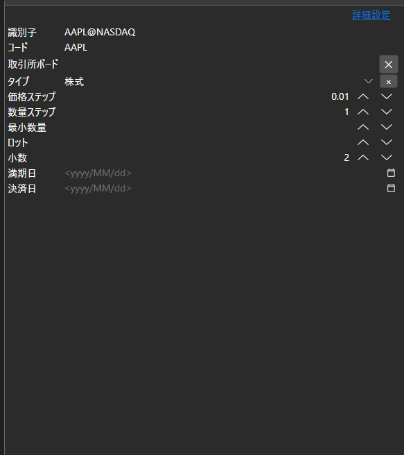
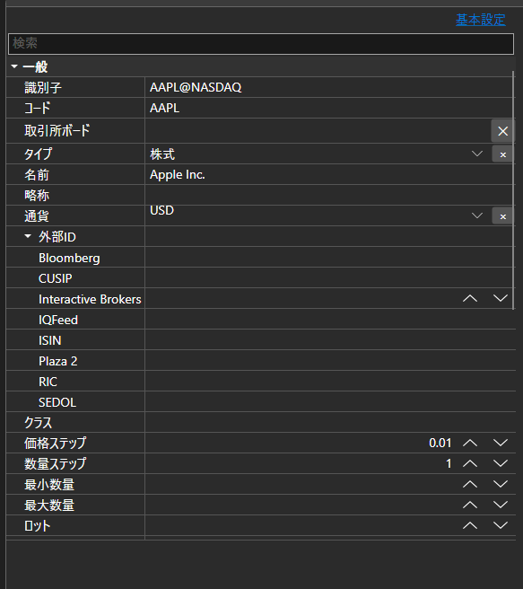

# 基本プロパティと詳細プロパティ





[BasicAdvPropertiesPanel](xref:StockSharp.Xaml.PropertyGrid.BasicAdvPropertiesPanel) - 2 つのモードを持つプロパティパネルです。基本モードでは必須項目の短い一覧を、詳細モードではオブジェクトの全プロパティをカテゴリ別に表示します。

**主なプロパティ**

- [BasicAdvPropertiesPanel.SelectedObject](xref:StockSharp.Xaml.PropertyGrid.BasicAdvPropertiesPanel.SelectedObject) - 編集対象のオブジェクト。
- [BasicAdvPropertiesPanel.IsAdvancedMode](xref:StockSharp.Xaml.PropertyGrid.BasicAdvPropertiesPanel.IsAdvancedMode) - 詳細モードかどうかのフラグ。
- [BasicAdvPropertiesPanel.PlainMaxDepth](xref:StockSharp.Xaml.PropertyGrid.BasicAdvPropertiesPanel.PlainMaxDepth) - 基本モードでの入れ子プロパティの展開の深さ。
- [BasicAdvPropertiesPanel.PostImmediately](xref:StockSharp.Xaml.PropertyGrid.BasicAdvPropertiesPanel.PostImmediately) - フォーカス移動を待たず、入力と同時に値を適用するかどうか。

2 つのモードはコネクタ設定によくある問題を解決します。必須項目は 3、4 個なのに、プロパティ全体は数十個あるからです。基本モードには接続に不可欠なものだけを表示し、それ以外は詳細モードで利用できます。

以下は使用例のコード断片です:

```xaml
<Window x:Class="Sample.SettingsWindow"
	xmlns="http://schemas.microsoft.com/winfx/2006/xaml/presentation"
	xmlns:x="http://schemas.microsoft.com/winfx/2006/xaml"
	xmlns:pg="clr-namespace:StockSharp.Xaml.PropertyGrid;assembly=StockSharp.Xaml"
	Height="500" Width="400">
	<pg:BasicAdvPropertiesPanel x:Name="PropertiesPanel" />
</Window>
```

```cs
// アダプタのプロパティを表示します
PropertiesPanel.SelectedObject = _adapter;

// 詳細モードに切り替えます
PropertiesPanel.IsAdvancedMode = true;

// 設定が変更されたことを記録します
PropertiesPanel.CellValueChanged += (sender, e) => _isModified = true;
```

## 関連項目

[値エディタ](../editors.md)
