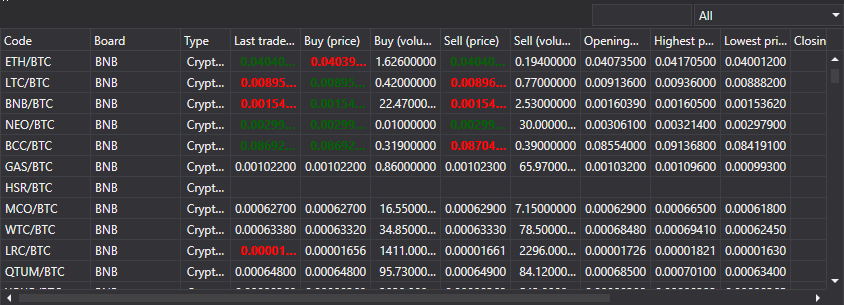

# テーブル

[SecurityGrid](xref:StockSharp.Xaml.SecurityGrid) コンポーネントは、銘柄に関する金融情報（level1 フィールド）とその変化を表形式で表示するために設計されています。このコンポーネントでは、1 つまたは複数の銘柄を選択できます。



**主なプロパティ**

- [SecurityGrid.Securities](xref:StockSharp.Xaml.SecurityGrid.Securities) - 銘柄のリスト。
- [SecurityGrid.SelectedSecurity](xref:StockSharp.Xaml.SecurityGrid.SelectedSecurity) - 選択された銘柄。
- [SecurityGrid.SelectedSecurities](xref:StockSharp.Xaml.SecurityGrid.SelectedSecurities) - 選択された銘柄のリスト。
- [SecurityGrid.MarketDataProvider](xref:StockSharp.Xaml.SecurityGrid.MarketDataProvider) - マーケットデータのプロバイダー。

マーケット情報の変化を表示するには、マーケットデータのプロバイダーを指定する必要があることに注意してください。

以下は、その使用例のコードスニペットです。

図では、[SecurityGrid](xref:StockSharp.Xaml.SecurityGrid) コンポーネントが [SecurityPicker](picker.md) グラフィカルコンポーネント内に表示されています。

```xaml
<Window x:Class="SecurityGridSample.MainWindow"
		xmlns="http://schemas.microsoft.com/winfx/2006/xaml/presentation"
		xmlns:x="http://schemas.microsoft.com/winfx/2006/xaml"
		xmlns:sx="clr-namespace:StockSharp.Xaml;assembly=StockSharp.Xaml"
		Title="MainWindow" Height="350" Width="525">
	<Grid>
		<sx:SecurityGrid x:Name="SecurityGrid"/>
	</Grid>
</Window>
	  				
```
```cs
private readonly Connector _connector = new Connector();
SecurityGrid.MarketDataProvider = _connector;
..........................
_connector.SecurityReceived += (sub, security) =>
{
	SecurityGrid.Securities.Add(security);
};
..........................
private void ColumnsFilter()
{
	string[]  columns = { "Board", "BestAsk.Price", "BestAsk.Volume" };
	
	foreach (var column in SecurityGrid.Columns)
	{
		column.Visibility = columns.Contains(column.SortMemberPath) ? Visibility.Visible : Visibility.Collapsed;
	}
}
				
```
