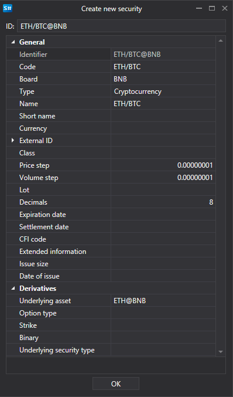

# ウィンドウ

[SecurityCreateWindow](xref:StockSharp.Xaml.SecurityCreateWindow) コンポーネントは、銘柄を作成および編集するためのウィンドウです。このコンポーネントは、特殊なテキストフィールド [SecurityIdTextBox](xref:StockSharp.Xaml.SecurityIdTextBox) と、プロパティ編集グリッド [PropertyGridEx](xref:StockSharp.Xaml.PropertyGrid.PropertyGridEx) という 2 つの主要要素で構成されます。作成（編集）された銘柄には、[SecurityCreateWindow.Security](xref:StockSharp.Xaml.SecurityCreateWindow.Security) プロパティでアクセスできます。

以下に、コンポーネントの外観と使用例のコードスニペットを示します。



```cs
private void Button_Click(object sender, RoutedEventArgs e)
{
	var dlg = new SecurityCreateWindow();
	var result = dlg.ShowDialog();
	if (result != null && (bool)result)
	{
		var security = dlg.Security;
	}
}
	
```
