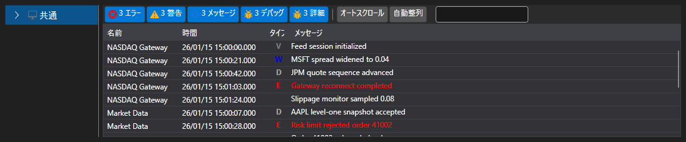

# 拡張ログパネル

[Monitor](xref:StockSharp.Xaml.Monitor) は、[ログパネル](log_panel.md)を **TreeView** 階層ツリーと組み合わせて使用する視覚要素であり、ツリーにはログソースが表示されます。当初、このコンポーネントは取引戦略を監視するために設計されました。そのため、既定では「ツリー」に **ストラテジー** ノードが含まれています。同時に、このコンポーネントでは他のソースも使用できます。



サンプルコード

```xaml
<Window x:Class="LoggingControls.MainWindow"
		xmlns="http://schemas.microsoft.com/winfx/2006/xaml/presentation"
		xmlns:x="http://schemas.microsoft.com/winfx/2006/xaml"
		xmlns:sx="clr-namespace:StockSharp.Xaml;assembly=StockSharp.Xaml"
		Title="MainWindow" Height="350" Width="525">
	<Grid>
		<sx:Monitor x:Name="Monitor" />
	</Grid>
</Window>
				
```
```cs
// LogManager の新しいインスタンスを作成します
_logManager = new LogManager();
// .NET トレースをログソースとして追加します。
_logManager.Sources.Add(new Ecng.Logging.TraceSource());
// Monitor をログリスナーとして追加します。
_logManager.Listeners.Add(new GuiLogListener(Monitor));
					
```
