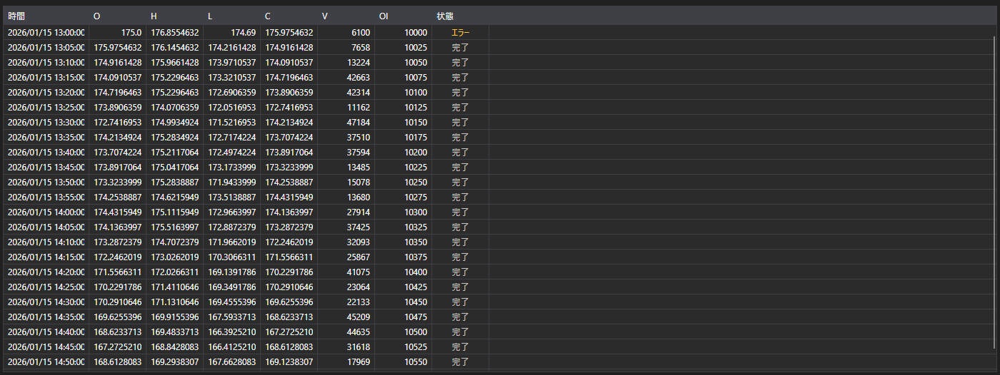

# ローソク足



[CandleMessageGrid](xref:StockSharp.Xaml.CandleMessageGrid) - ローソク足のテーブルです。始値、高値、安値、終値、出来高、建玉、そして各ローソク足の状態を表示します。

**主なプロパティ**

- [CandleMessageGrid.Messages](xref:StockSharp.Xaml.CandleMessageGrid.Messages) - ローソク足の一覧。
- [CandleMessageGrid.SelectedMessage](xref:StockSharp.Xaml.CandleMessageGrid.SelectedMessage) - 選択されたローソク足。
- [CandleMessageGrid.SelectedMessages](xref:StockSharp.Xaml.CandleMessageGrid.SelectedMessages) - 選択された複数のローソク足。

## ローソク足の状態

**State** 列は [CandleStates](xref:StockSharp.Messages.CandleStates) の値で色分けされ、スクリーンショットには three すべてが写っています:

- **Active** - まだ形成中のローソク足です。値が変化し続けるため強調表示されます。確定したローソク足として扱ってはいけません。
- **Finished** - 確定したローソク足で、値は最終的なものです。中立色で、テーブルの大半の行がこれにあたります。
- **None** - 状態が届かなかった場合です。テーブルでは **エラー** と表示され、警告として色付けされます。空の値ではなく、データが不完全に届いた印です。

つまり最初の行に **エラー** が出るローソク足サブスクリプションは、状態のないローソク足ではなく、データソースの問題を知らせています。

以下は使用例のコード断片です:

```xaml
<Window x:Class="Sample.CandlesWindow"
	xmlns="http://schemas.microsoft.com/winfx/2006/xaml/presentation"
	xmlns:x="http://schemas.microsoft.com/winfx/2006/xaml"
	xmlns:xaml="http://schemas.stocksharp.com/xaml"
	Title="ローソク足" Height="400" Width="800">
	<xaml:CandleMessageGrid x:Name="CandleGrid" x:FieldModifier="public" />
</Window>
```

```cs
public class CandlesWindow
{
	private readonly Connector _connector;
	private readonly Security _security;
	private Subscription _candleSubscription;

	public CandlesWindow(Connector connector, Security security)
	{
		InitializeComponent();

		_connector = connector;
		_security = security;

		// ローソク足受信イベントを購読する
		_connector.CandleReceived += OnCandleReceived;

		// 5分足のサブスクリプションを作成する
		_candleSubscription = new Subscription(TimeSpan.FromMinutes(5).TimeFrame(), security);

		// サブスクリプションを開始する
		_connector.Subscribe(_candleSubscription);
	}

	// ローソク足受信ハンドラ
	private void OnCandleReceived(Subscription subscription, ICandleMessage candle)
	{
		// ローソク足が自分のサブスクリプションのものか確認する
		if (subscription != _candleSubscription)
			return;

		// UI スレッドでテーブルにローソク足を追加する
		this.GuiAsync(() => CandleGrid.Messages.Add((CandleMessage)candle));
	}

	// ウィンドウを閉じるときに購読を解除する
	public void Unsubscribe()
	{
		if (_candleSubscription != null)
		{
			_connector.CandleReceived -= OnCandleReceived;
			_connector.UnSubscribe(_candleSubscription);
			_candleSubscription = null;
		}
	}
}
```

### 確定したローソク足のみ

ローソク足は確定するまで何度も届くため、更新のたびにテーブルが増えます。最終値だけが必要な場合は状態で絞り込みます:

```cs
private void OnCandleReceived(Subscription subscription, ICandleMessage candle)
{
	if (subscription != _candleSubscription)
		return;

	// まだ形成中のものはすべて飛ばす
	if (candle.State != CandleStates.Finished)
		return;

	this.GuiAsync(() => CandleGrid.Messages.Add((CandleMessage)candle));
}
```

### 現在のローソク足をその場で更新する

現在のローソク足をテーブルに残したまま、追加ではなく更新するには、確定するまで最後の行を置き換えます:

```cs
private void OnCandleReceived(Subscription subscription, ICandleMessage candle)
{
	if (subscription != _candleSubscription)
		return;

	var message = (CandleMessage)candle;

	this.GuiAsync(() =>
	{
		var last = CandleGrid.Messages.LastOrDefault();

		// 最後の行と同じローソク足なので置き換える
		if (last != null && last.OpenTime == message.OpenTime)
			CandleGrid.Messages[CandleGrid.Messages.Count - 1] = message;
		else
			CandleGrid.Messages.Add(message);
	});
}
```

### 過去のローソク足の読み込み

```cs
// 過去のローソク足を読み込む
public void LoadHistoricalCandles(Security security, TimeSpan timeFrame, DateTime from, DateTime to)
{
	// 現在のローソク足を消去する
	CandleGrid.Messages.Clear();

	// 過去のローソク足のサブスクリプションを作成する
	var historySubscription = new Subscription(timeFrame.TimeFrame(), security)
	{
		MarketData =
		{
			// 過去データを要求する期間を指定する
			From = from,
			To = to
		}
	};

	_connector.CandleReceived += OnCandleReceived;
	_connector.Subscribe(historySubscription);
}
```

## 関連項目

[ティック約定](ticks.md)
