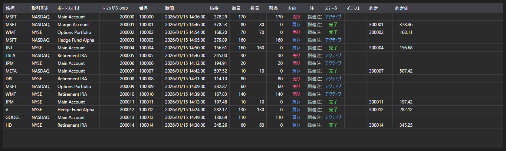

# トランザクションと約定



[ExecutionGrid](xref:StockSharp.Xaml.ExecutionGrid) - [ExecutionMessage](xref:StockSharp.Messages.ExecutionMessage) メッセージ用の汎用テーブルです。1 つのコントロールでティック、オーダーログ、自己トランザクションを表示し、データ種別は [ExecutionMessage.DataTypeEx](xref:StockSharp.Messages.ExecutionMessage.DataTypeEx) で決まります。

**主なプロパティ**

- [ExecutionGrid.Messages](xref:StockSharp.Xaml.ExecutionGrid.Messages) - メッセージの一覧。
- [ExecutionGrid.SelectedMessage](xref:StockSharp.Xaml.ExecutionGrid.SelectedMessage) - 選択されたメッセージ。
- [ExecutionGrid.SelectedMessages](xref:StockSharp.Xaml.ExecutionGrid.SelectedMessages) - 選択された複数のメッセージ。
- [ExecutionGrid.MaxCount](xref:StockSharp.Xaml.ExecutionGrid.MaxCount) - テーブルの最大行数。超過すると最も古い行が削除されます。

同じテーブルが 3 種類のデータを扱うため、不要な列は [ExecutionGrid.HideColumns](xref:StockSharp.Xaml.ExecutionGrid.HideColumns(StockSharp.Messages.DataType)) で非表示にします。ティックには注文の列は不要で、オーダーログには自己約定の列は不要です。

以下は使用例のコード断片です:

```xaml
<Window x:Class="Sample.ExecutionsWindow"
	xmlns="http://schemas.microsoft.com/winfx/2006/xaml/presentation"
	xmlns:x="http://schemas.microsoft.com/winfx/2006/xaml"
	xmlns:xaml="http://schemas.stocksharp.com/xaml"
	Height="400" Width="900">
	<xaml:ExecutionGrid x:Name="ExecutionGrid" />
</Window>
```

```cs
// トランザクションに関する列だけを残します
ExecutionGrid.HideColumns(DataType.Transactions);

// UI スレッドで注文をテーブルに追加します
_connector.OrderReceived += (subscription, order) =>
	this.GuiAsync(() => ExecutionGrid.Messages.Add(order.ToMessage()));

// テーブルのサイズを制限します
ExecutionGrid.MaxCount = 100000;
```

## 関連項目

[マーケットデータ](../market_data.md)
