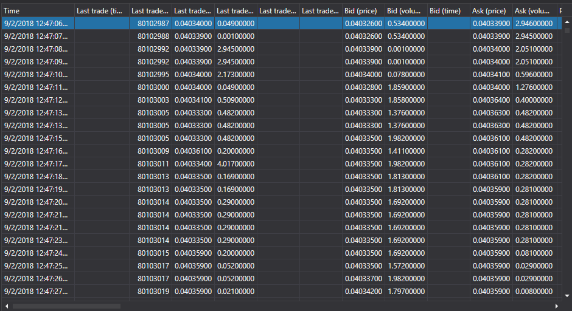

# Level1



[Level1Grid](xref:StockSharp.Xaml.Level1Grid) は、Level1 フィールドを表示するためのテーブルです。このテーブルは、[Level1ChangeMessage](xref:StockSharp.Messages.Level1ChangeMessage) メッセージ形式のデータを使用します。

**主なプロパティ**

- [Level1Grid.MaxCount](xref:StockSharp.Xaml.Level1Grid.MaxCount) - 表示するメッセージの最大数。
- [Level1Grid.Messages](xref:StockSharp.Xaml.Level1Grid.Messages) - テーブルに追加されたメッセージのリスト。
- [Level1Grid.SelectedMessage](xref:StockSharp.Xaml.Level1Grid.SelectedMessage) - 選択されたメッセージ。
- [Level1Grid.SelectedMessages](xref:StockSharp.Xaml.Level1Grid.SelectedMessages) - 選択されたメッセージ群。

以下は、その使用方法を示すコード断片です。

```xaml
<Window x:Class="Membrane02.Level1Window"
		xmlns="http://schemas.microsoft.com/winfx/2006/xaml/presentation"
		xmlns:x="http://schemas.microsoft.com/winfx/2006/xaml"
		xmlns:d="http://schemas.microsoft.com/expression/blend/2008"
		xmlns:mc="http://schemas.openxmlformats.org/markup-compatibility/2006"
		xmlns:sx="http://schemas.stocksharp.com/xaml"
		xmlns:local="clr-namespace:Membrane02"
		mc:Ignorable="d"
		Title="Level1Window" Height="300" Width="300" Closing="Window_Closing">
	<Grid>
		<sx:Level1Grid x:Name="Level1Grid" />
	</Grid>
</Window>
```

```cs
public Level1Window()
{
	InitializeComponent();
	_connector = MainWindow.This.Connector;
	
	// Level1 データ受信イベントを購読します
	_connector.Level1Received += OnLevel1Received;
	
	// まだ購読していない場合は Level1 データへの購読を作成します
	var security = MainWindow.This.SelectedSecurity;
	if (!_connector.Subscriptions.Any(s => 
			s.DataType == DataType.Level1 && 
			s.SecurityId == security.ToSecurityId()))
	{
		var subscription = new Subscription(DataType.Level1, security);
		_connector.Subscribe(subscription);
	}
}

private void OnLevel1Received(Subscription subscription, Level1ChangeMessage level1Message)
{
	// メッセージが選択された銘柄に属しているか確認します
	if (level1Message.SecurityId != MainWindow.This.SelectedSecurity.ToSecurityId())
		return;
		
	// メッセージを Level1Grid に追加します
	this.GuiAsync(() => Level1Grid.Messages.Add(level1Message));
}

private void Window_Closing(object sender, System.ComponentModel.CancelEventArgs e)
{
	// ウィンドウを閉じるときにイベントの購読を解除します
	if (_connector != null)
		_connector.Level1Received -= OnLevel1Received;
}
```

### Level1 データを処理する推奨方法

```cs
// 複数の銘柄を使用して Level1 への購読を作成します
public void SubscribeToLevel1(IEnumerable<Security> securities)
{
	foreach (var security in securities)
	{
		var subscription = new Subscription(DataType.Level1, security);
		_connector.Subscribe(subscription);
	}
	
	// Level1 データ受信イベントを購読します
	_connector.Level1Received += OnLevel1Received;
}

// Level1 データ受信イベントのハンドラー
private void OnLevel1Received(Subscription subscription, Level1ChangeMessage level1Message)
{
	// この特定のメッセージを処理する必要があるか確認します
	if (IsLevel1Needed(subscription))
	{
		// ユーザーインターフェイススレッドで GUI を更新します
		this.GuiAsync(() => 
		{
			// メッセージを Level1Grid に追加します
			Level1Grid.Messages.Add(level1Message);
			
			// Level1 フィールドの変更を処理します
			foreach (var change in level1Message.Changes)
			{
				switch (change.Key)
				{
					case Level1Fields.LastTradePrice:
						// 直近約定価格の変更を処理します
						var lastPrice = (decimal)change.Value;
						Console.WriteLine($"Last price {security.Code}: {lastPrice}");
						break;
						
					case Level1Fields.BestBidPrice:
						// 最良買気配価格の変更を処理します
						var bestBid = (decimal)change.Value;
						Console.WriteLine($"Best bid {security.Code}: {bestBid}");
						break;
						
					case Level1Fields.BestAskPrice:
						// 最良売気配価格の変更を処理します
						var bestAsk = (decimal)change.Value;
						Console.WriteLine($"Best ask {security.Code}: {bestAsk}");
						break;
				}
			}
		});
	}
}
```
