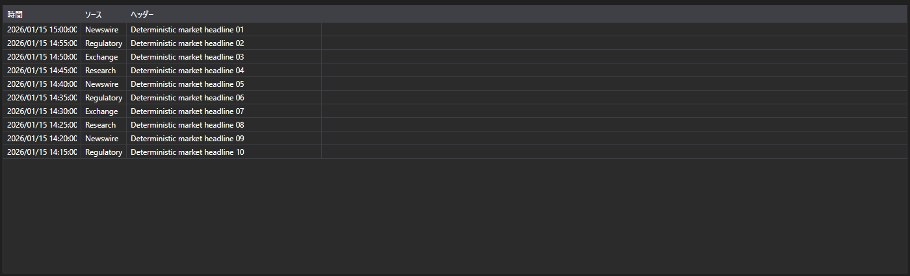
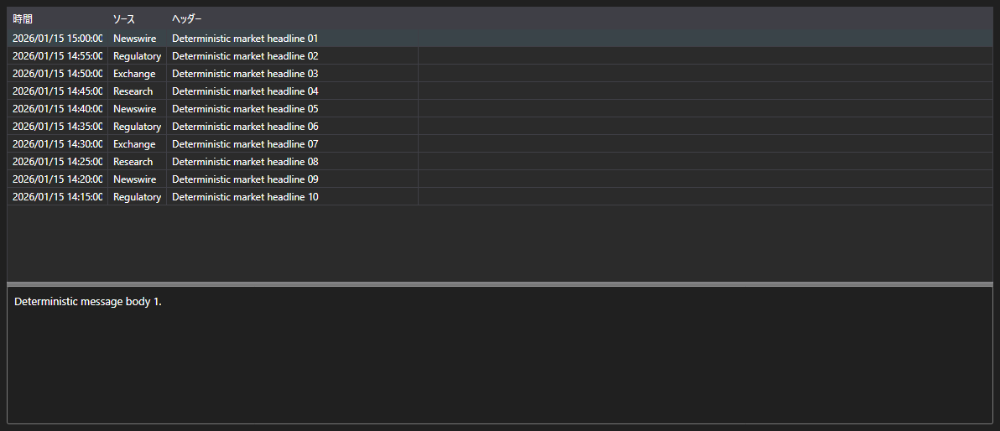

# メッセージ形式のニュース





[NewsMessageGrid](xref:StockSharp.Xaml.NewsMessageGrid) - ビジネスエンティティではなく [NewsMessage](xref:StockSharp.Messages.NewsMessage) メッセージを扱うニューステーブルです。時刻、ソース、識別子、見出し、本文へのリンクを表示します。

**主なプロパティ**

- [NewsMessageGrid.Messages](xref:StockSharp.Xaml.NewsMessageGrid.Messages) - ニュースメッセージの一覧。
- [NewsMessageGrid.SelectedMessage](xref:StockSharp.Xaml.NewsMessageGrid.SelectedMessage) - 選択されたメッセージ。
- [NewsMessageGrid.SelectedMessages](xref:StockSharp.Xaml.NewsMessageGrid.SelectedMessages) - 選択された複数のメッセージ。
- [NewsMessageGrid.MaxCount](xref:StockSharp.Xaml.NewsMessageGrid.MaxCount) - テーブルの最大行数。超過すると最も古い行が削除されます。
- [NewsMessageGrid.SubscriptionProvider](xref:StockSharp.Xaml.NewsMessageGrid.SubscriptionProvider) - テーブルがニュース本文を要求するサブスクリプションプロバイダ。

テーブルと本文を組み合わせた既製のコントロールが [NewsMessagePanel](xref:StockSharp.Xaml.NewsMessagePanel) です。[NewsMessageGrid](xref:StockSharp.Xaml.NewsMessageGrid) と [NewsStoryPanel](xref:StockSharp.Xaml.NewsStoryPanel) を含み、行を選択するとサブスクリプションプロバイダに本文を要求し、下部に表示します。

以下は使用例のコード断片です:

```xaml
<Window x:Class="Sample.NewsWindow"
	xmlns="http://schemas.microsoft.com/winfx/2006/xaml/presentation"
	xmlns:x="http://schemas.microsoft.com/winfx/2006/xaml"
	xmlns:xaml="http://schemas.stocksharp.com/xaml"
	Height="400" Width="900">
	<xaml:NewsMessagePanel x:Name="NewsPanel" />
</Window>
```

```cs
// サブスクリプションプロバイダを設定します。ニュース本文はこれを介して要求されます
NewsPanel.SubscriptionProvider = _connector;

// 受信したニュースを UI スレッドでテーブルに追加します
_connector.NewsReceived += (subscription, news) =>
	this.GuiAsync(() => NewsPanel.NewsGrid.Messages.Add(news.ToMessage()));

// ニュースのサブスクリプションを作成します
_connector.Subscribe(new Subscription(DataType.News));
```

## 関連項目

[マーケットデータ](../market_data.md)
