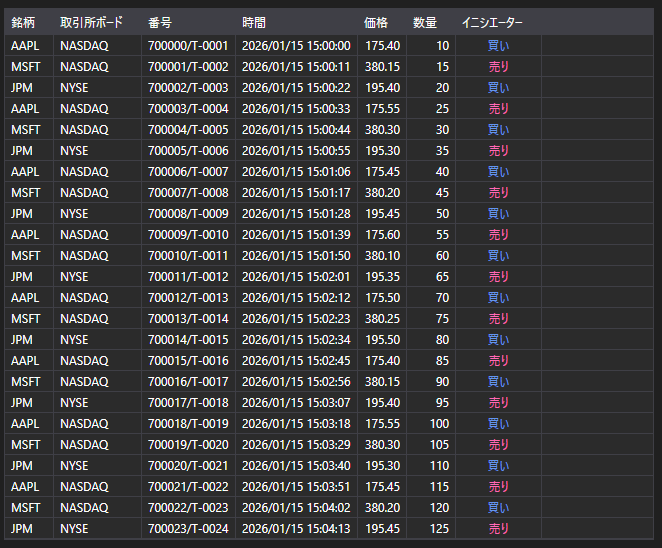

# ティック約定



[TradeGrid](xref:StockSharp.Xaml.TradeGrid) は、約定テーブルです。

**主なプロパティ**

- [TradeGrid.Trades](xref:StockSharp.Xaml.TradeGrid.Trades) - 約定のリスト。
- [TradeGrid.SelectedTrade](xref:StockSharp.Xaml.TradeGrid.SelectedTrade) - 選択された約定。
- [TradeGrid.SelectedTrades](xref:StockSharp.Xaml.TradeGrid.SelectedTrades) - 選択された約定群。

以下は、その使用方法を示すコード断片です。

```xaml
<Window x:Class="Sample.TradesWindow"
	xmlns="http://schemas.microsoft.com/winfx/2006/xaml/presentation"
	xmlns:x="http://schemas.microsoft.com/winfx/2006/xaml"
	xmlns:loc="clr-namespace:StockSharp.Localization;assembly=StockSharp.Localization"
	xmlns:xaml="http://schemas.stocksharp.com/xaml"
	Title="{x:Static loc:LocalizedStrings.Str985}" Height="284" Width="544">
	<xaml:TradeGrid x:Name="TradeGrid" x:FieldModifier="public" />
</Window>
```

```cs
public class TradesWindow
{
	private readonly Connector _connector;
	private readonly Security _security;
	private Subscription _tickSubscription;
	
	public TradesWindow(Connector connector, Security security)
	{
		InitializeComponent();
		
		_connector = connector;
		_security = security;
		
		// ティック約定受信イベントを購読します
		_connector.TickTradeReceived += OnTickReceived;
		
		// ティック約定への購読を作成します
		_tickSubscription = new Subscription(DataType.Ticks, security);
		
		// 購読を開始します
		_connector.Subscribe(_tickSubscription);
	}
	
	// ティック約定受信イベントのハンドラー
	private void OnTickReceived(Subscription subscription, ITickTradeMessage tick)
	{
		// 約定が自分の購読に属しているか確認します
		if (subscription != _tickSubscription)
			return;
			
		// ユーザーインターフェイススレッドで約定を TradeGrid に追加します
		this.GuiAsync(() => TradeGrid.Trades.Add(tick));
	}
	
	// ウィンドウを閉じるときに購読を解除するメソッド
	public void Unsubscribe()
	{
		if (_tickSubscription != null)
		{
			_connector.TickTradeReceived -= OnTickReceived;
			_connector.UnSubscribe(_tickSubscription);
			_tickSubscription = null;
		}
	}
}
```

### 自分の約定を表示する

```cs
public class MyTradesWindow
{
	private readonly Connector _connector;
	
	public MyTradesWindow(Connector connector)
	{
		InitializeComponent();
		
		_connector = connector;
		
		// 自分の約定受信イベントを購読します
		_connector.OwnTradeReceived += OnOwnTradeReceived;
		
		// トランザクションデータへの購読を作成します
		var myTradesSubscription = new Subscription(DataType.Transactions, null);
		
		// 購読を開始します
		_connector.Subscribe(myTradesSubscription);
	}
	
	// 自分の約定受信イベントのハンドラー
	private void OnOwnTradeReceived(Subscription subscription, MyTrade myTrade)
	{
		// ユーザーインターフェイススレッドで自分の約定を TradeGrid に追加します
		this.GuiAsync(() => TradeGrid.Trades.Add(myTrade));
	}
}
```

### 履歴ティック約定を取得する

```cs
// 履歴ティック約定を取得するメソッド
public void LoadHistoricalTicks(Security security, DateTime from, DateTime to)
{
	// 現在の約定をクリアします
	TradeGrid.Trades.Clear();
	
	// 履歴ティック約定への購読を作成します
	var historySubscription = new Subscription(DataType.Ticks, security)
	{
		MarketData =
		{
			// 履歴データの期間を指定します
			From = from,
			To = to
		}
	};
	
	// ティック約定受信イベントを購読します
	_connector.TickTradeReceived += OnHistoricalTickReceived;
	
	// 購読を開始します
	_connector.Subscribe(historySubscription);
}

// 履歴ティック約定受信イベントのハンドラー
private void OnHistoricalTickReceived(Subscription subscription, ITickTradeMessage tick)
{
	// ユーザーインターフェイススレッドでティックを TradeGrid に追加します
	this.GuiAsync(() => 
	{
		TradeGrid.Trades.Add(tick);
		
		// 統計を更新します
		UpdateTradeStatistics();
	});
}

// 約定統計を更新するメソッド
private void UpdateTradeStatistics()
{
	int totalTrades = TradeGrid.Trades.Count;
	decimal totalVolume = TradeGrid.Trades.Sum(t => t.Volume);
	decimal averagePrice = TradeGrid.Trades.Any() 
		? TradeGrid.Trades.Average(t => t.Price)
		: 0;
	
	// インターフェイスの統計要素を更新します
	TotalTradesLabel.Content = $"Total trades: {totalTrades}";
	TotalVolumeLabel.Content = $"Total volume: {totalVolume}";
	AveragePriceLabel.Content = $"Average price: {averagePrice:F2}";
}
```

### 数量で約定をフィルタリングする

```cs
// 最小数量で約定をフィルタリングするメソッド
public void FilterTicksByVolume(decimal minVolume)
{
	// フィルター値を保存します
	_minVolumeFilter = minVolume;
	
	// ティック約定受信イベントハンドラーを更新します
	_connector.TickTradeReceived -= OnTickReceived;
	_connector.TickTradeReceived += OnFilteredTickReceived;
}

// 数量フィルタリング付きティック約定受信イベントのハンドラー
private void OnFilteredTickReceived(Subscription subscription, ITickTradeMessage tick)
{
	// 約定が選択された銘柄に属しているか確認します
	if (tick.SecurityId != _security.ToSecurityId())
		return;
		
	// 数量フィルターを適用します
	if (tick.Volume < _minVolumeFilter)
		return;
		
	// ユーザーインターフェイススレッドで約定を TradeGrid に追加します
	this.GuiAsync(() => TradeGrid.Trades.Add(tick));
	
	// 大口約定の場合は、強調表示または通知を送信できます
	if (tick.Volume >= _largeVolumeThreshold)
	{
		NotifyLargeVolumeTrade(tick);
	}
}

// 大口約定通知のメソッド
private void NotifyLargeVolumeTrade(ITickTradeMessage tick)
{
	// 大口約定に関する情報を出力します
	Console.WriteLine($"大口取引: {tick.SecurityId}, {tick.ServerTime}, 価格: {tick.Price}, 出来高: {tick.Volume}");
	
	// 音声または視覚的な通知を追加できます
	this.GuiAsync(() => 
	{
		// リスト内で視覚的に強調表示する例
		var tradeItem = TradeGrid.Trades.LastOrDefault();
		if (tradeItem != null)
		{
			TradeGrid.SelectedTrade = tradeItem;
			HighlightTrade(tradeItem);
		}
	});
}
```
