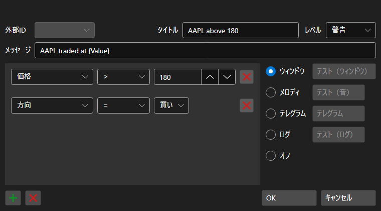

# 通知設定ウィンドウ

[AlertSettingsWindow](xref:StockSharp.Alerts.AlertSettingsWindow) は、特定のイベントに対する通知を設定するためのウィンドウです。

次のデータ型の変更に関する通知を設定できます: ポートフォリオ、顧客コード、ブローカー、保管機関、サーバー時刻、トランザクション、データ型、キャンセル、注文 ID、注文 ID（文字列）、注文 ID（プラットフォーム）、デリバティブ、デリバティブ（文字列）、価格、数量（注文）、数量（取引）、表示数量、方向、残高、注文タイプ、状態、コメント、注文メッセージ、システム注文、注文有効期限、執行条件、価格、取引開始者、未決済建玉、エラー、条件、上昇トレンド、手数料、遅延、スリッページ、識別子（ユーザー）、通貨、P\/L、ポジション、マーケットメーカー。

通知は次の形式にできます。

- **ウィンドウ** - メッセージ付きの小さなポップアップウィンドウが画面の隅に表示されます。
- **メロディー** - メロディが再生されます。
- **SMS** - SMS でメッセージが送信されます。
- **Email** - email でメッセージが送信されます。
- **音声** - コンピューター生成音声でメッセージが読み上げられます。
- **ログ** - メッセージが Designer Logs ウィンドウに送信されます。
- **無効** - 通知は表示されません。
