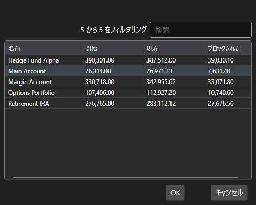

# ポートフォリオピッカーウィンドウ

[PortfolioPickerWindow](xref:StockSharp.Xaml.PortfolioPickerWindow) は、ポートフォリオを選択するためのウィンドウです。このウィンドウには、ポートフォリオの一覧と、ポートフォリオの現金ポジションに関する情報が表示されます。



**主なプロパティ**

- [PortfolioPickerWindow.Portfolios](xref:StockSharp.Xaml.PortfolioPickerWindow.Portfolios) - ポートフォリオの一覧。
- [PortfolioPickerWindow.SelectedPortfolio](xref:StockSharp.Xaml.PortfolioPickerWindow.SelectedPortfolio) - 選択されたポートフォリオ。

以下は、その使用例のコードスニペットです。 

```cs
private void Button_Click(object sender, RoutedEventArgs e)
{
	var wnd = new PortfolioPickerWindow();
	if (Portfolios != null)
		wnd.Portfolios = Portfolios;
	if (wnd.ShowModal(this))
	{
		SelectedPortfolio = wnd.SelectedPortfolio;
	}
}
	  				
```
