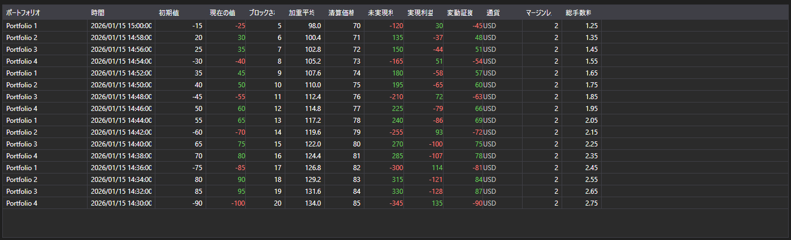

# ポジションの変化



[PositionChangeGrid](xref:StockSharp.Xaml.PositionChangeGrid) - [PositionChangeMessage](xref:StockSharp.Messages.PositionChangeMessage) メッセージのテーブルです。ポートフォリオ表とは異なり現在の状態ではなく変化の流れを表示し、各行が変化した値の集合を持つ 1 件のメッセージです。

**主なプロパティ**

- [PositionChangeGrid.Messages](xref:StockSharp.Xaml.PositionChangeGrid.Messages) - ポジション変化メッセージの一覧。
- [PositionChangeGrid.SelectedMessage](xref:StockSharp.Xaml.PositionChangeGrid.SelectedMessage) - 選択されたメッセージ。
- [PositionChangeGrid.SelectedMessages](xref:StockSharp.Xaml.PositionChangeGrid.SelectedMessages) - 選択された複数のメッセージ。
- [PositionChangeGrid.MaxCount](xref:StockSharp.Xaml.PositionChangeGrid.MaxCount) - テーブルの最大行数。超過すると最も古い行が削除されます。

この流れは差異の調査に便利です。最終結果だけでなく、コネクタがどの値をいつ送ってきたかが分かります。

以下は使用例のコード断片です:

```xaml
<Window x:Class="Sample.PositionChangesWindow"
	xmlns="http://schemas.microsoft.com/winfx/2006/xaml/presentation"
	xmlns:x="http://schemas.microsoft.com/winfx/2006/xaml"
	xmlns:xaml="http://schemas.stocksharp.com/xaml"
	Height="400" Width="900">
	<xaml:PositionChangeGrid x:Name="PositionChangeGrid" />
</Window>
```

```cs
// コネクタからポジションの変化を受け取ります
_connector.PositionReceived += (subscription, position) =>
{
	var message = position.ToChangeMessage();

	// UI スレッドでメッセージをテーブルに追加します
	this.GuiAsync(() => PositionChangeGrid.Messages.Add(message));
};

// ポジション変化のサブスクリプションを作成します
_connector.Subscribe(new Subscription(DataType.PositionChanges));
```

## 関連項目

[ポートフォリオ](../portfolios.md)
