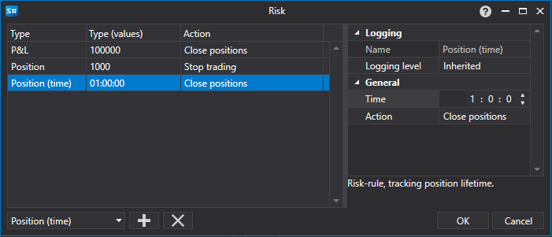

# リスク設定ウィンドウ

[AlertSettingsWindow](xref:StockSharp.Alerts.AlertSettingsWindow) - リスク管理を設定するための専用ウィンドウです。 



以下は、ストラテジー用のリスク管理設定ウィンドウを呼び出すコード例です。 

```cs
		private void RiskButton_OnClick(object sender, RoutedEventArgs e)
		{
			var wnd = new RiskWindow();
			wnd.Rules.AddRange(Strategy.RiskManager.Rules.Select(r => r.Clone()));
			if (!wnd.ShowModal(this))
				return;
			Strategy.RiskManager.Rules.Clear();
			Strategy.RiskManager.Rules.AddRange(wnd.Rules);
		}
	  				
```
