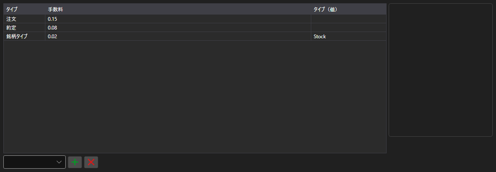

# 手数料ルール



[CommissionPanel](xref:StockSharp.Xaml.CommissionPanel) - 手数料ルールのテーブルです。各行は [ICommissionRule](xref:StockSharp.Algo.Commissions.ICommissionRule) ルールで、約定ごと、数量ごと、売買代金ごと、金額に対する割合などを指定します。

**主なプロパティ**

- [CommissionPanel.Rules](xref:StockSharp.Xaml.CommissionPanel.Rules) - 手数料ルールの一覧。

このテーブルのルールは手数料マネージャに渡されるため、ヒストリカルテストでも実運用と同じようにコストが計算されます。

以下は使用例のコード断片です:

```xaml
<Window x:Class="Sample.CommissionWindow"
	xmlns="http://schemas.microsoft.com/winfx/2006/xaml/presentation"
	xmlns:x="http://schemas.microsoft.com/winfx/2006/xaml"
	xmlns:xaml="http://schemas.stocksharp.com/xaml"
	Height="300" Width="700">
	<xaml:CommissionPanel x:Name="CommissionPanel" />
</Window>
```

```cs
// 約定ごとの手数料
CommissionPanel.Rules.Add(new CommissionPerTradeRule { Value = 1.5m });

// 注文数量あたりの手数料
CommissionPanel.Rules.Add(new CommissionPerOrderVolumeRule { Value = 0.01m });

// 手数料マネージャにルールを適用します
_connector.CommissionManager.Rules.Clear();
_connector.CommissionManager.Rules.AddRange(CommissionPanel.Rules);
```

## 関連項目

[サービスパネル](../service_panels.md)
