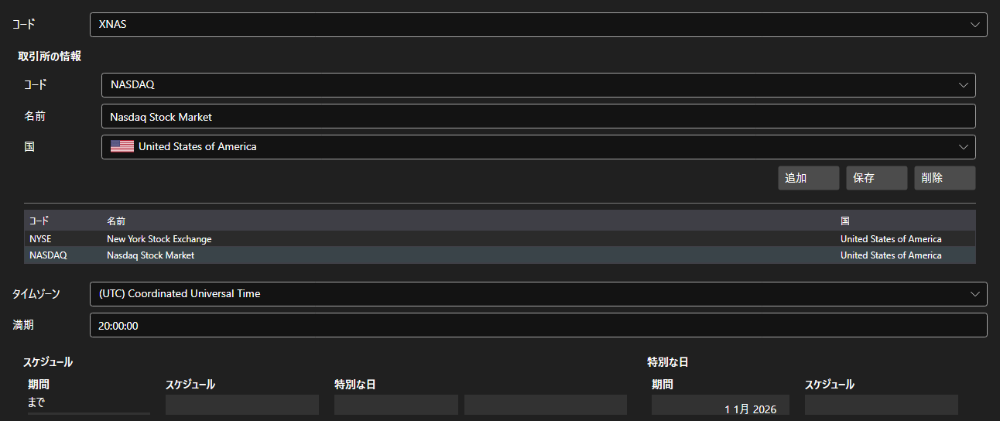

# 市場



[ExchangeBoardsPanel](xref:StockSharp.Xaml.ExchangeBoardsPanel) - [ExchangeBoard](xref:StockSharp.BusinessEntities.ExchangeBoard) 市場の一覧です。市場ごとにコード、取引所、タイムゾーン、営業スケジュールを設定します。

**主なプロパティ**

- [ExchangeBoardsPanel.Boards](xref:StockSharp.Xaml.ExchangeBoardsPanel.Boards) - 市場の一覧。
- [ExchangeBoardsPanel.SelectedBoardCode](xref:StockSharp.Xaml.ExchangeBoardsPanel.SelectedBoardCode) - 選択中の市場のコード。

スケジュールは組み込みの [WorkingTimeControl](xref:StockSharp.Xaml.WorkingTimeControl) で編集します。ヒストリカルテストは、このスケジュールから市場が開いている時間と閉まっている時間を知ります。

以下は使用例のコード断片です:

```xaml
<Window x:Class="Sample.BoardsWindow"
	xmlns="http://schemas.microsoft.com/winfx/2006/xaml/presentation"
	xmlns:x="http://schemas.microsoft.com/winfx/2006/xaml"
	xmlns:xaml="http://schemas.stocksharp.com/xaml"
	Height="500" Width="800">
	<xaml:ExchangeBoardsPanel x:Name="BoardsPanel" />
</Window>
```

```cs
// 市場を選びます
BoardsPanel.SetBoardCode(ExchangeBoard.MicexTqbr.Code);

// 一覧が変更されたことを記録します
BoardsPanel.Changed += () => _isModified = true;

// 市場を保存します
foreach (var board in BoardsPanel.Boards)
	_exchangeInfoProvider.Save(board);
```

## 関連項目

[サービスパネル](../service_panels.md)
