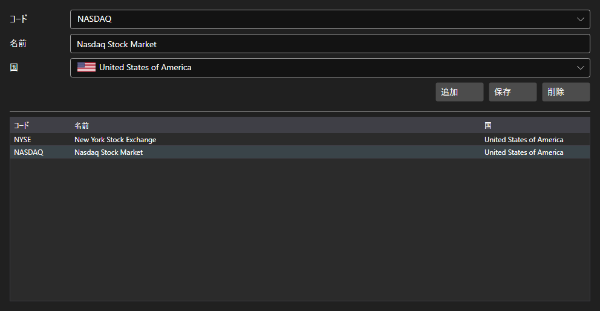

# 取引所



[ExchangesPanel](xref:StockSharp.Xaml.ExchangesPanel) - 取引所の一覧です。名称と国を伴う [Exchange](xref:StockSharp.BusinessEntities.Exchange) の一覧を表示し、独自の取引所を追加できます。

**主なプロパティ**

- [ExchangesPanel.Exchanges](xref:StockSharp.Xaml.ExchangesPanel.Exchanges) - 取引所 [Exchange](xref:StockSharp.BusinessEntities.Exchange) の一覧。
- [ExchangesPanel.SelectedExchangeName](xref:StockSharp.Xaml.ExchangesPanel.SelectedExchangeName) - 選択中の取引所の名称。

このパネルは通常 [ExchangeBoardsPanel](xref:StockSharp.Xaml.ExchangeBoardsPanel) と組にして使います。ここで選んだ取引所が、あちらに表示される市場を決めます。選択の変更は `SelectedExchangeChanged` イベントで通知されます。

以下は使用例のコード断片です:

```xaml
<Window x:Class="Sample.ExchangesWindow"
	xmlns="http://schemas.microsoft.com/winfx/2006/xaml/presentation"
	xmlns:x="http://schemas.microsoft.com/winfx/2006/xaml"
	xmlns:xaml="http://schemas.stocksharp.com/xaml"
	Height="400" Width="600">
	<xaml:ExchangesPanel x:Name="ExchangesPanel" />
</Window>
```

```cs
// 取引所を選びます
ExchangesPanel.SetExchange(Exchange.Moex.Name);

// 取引所が変わったら市場の選択をリセットします
ExchangesPanel.SelectedExchangeChanged += () =>
	BoardsPanel.SetBoardCode(null);

// 一覧を保存します
foreach (var exchange in ExchangesPanel.Exchanges)
	_exchangeInfoProvider.Save(exchange);
```

## 関連項目

[サービスパネル](../service_panels.md)
