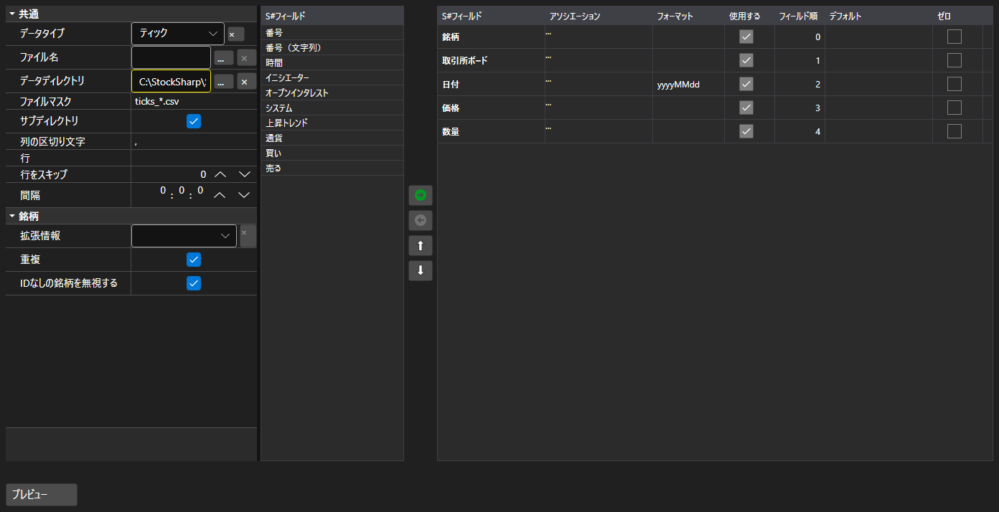

# インポート設定



[ImportSettingsPanel](xref:StockSharp.Xaml.ImportSettingsPanel) - テキストファイルからのデータ取り込みを設定するパネルです。区切り文字、日付と時刻の書式、文字コード、そして何より列の構成と順序を指定します。

**主なプロパティ**

- [ImportSettingsPanel.Settings](xref:StockSharp.Xaml.ImportSettingsPanel.Settings) - インポート設定。
- [ImportSettingsPanel.SelectedFields](xref:StockSharp.Xaml.ImportSettingsPanel.SelectedFields) - ファイル内の並び順に従って選択された項目。
- [ImportSettingsPanel.UnSelectedFields](xref:StockSharp.Xaml.ImportSettingsPanel.UnSelectedFields) - ファイルに含まれない項目。

項目は 2 つの一覧の間で移動し、上下に並べ替えて、ファイルの列順と一致させます。[ImportSettingsPanel.HasErrors](xref:StockSharp.Xaml.ImportSettingsPanel.HasErrors) メソッドは取り込み開始前に設定を検証します。

以下は使用例のコード断片です:

```xaml
<Window x:Class="Sample.ImportWindow"
	xmlns="http://schemas.microsoft.com/winfx/2006/xaml/presentation"
	xmlns:x="http://schemas.microsoft.com/winfx/2006/xaml"
	xmlns:xaml="http://schemas.stocksharp.com/xaml"
	Height="600" Width="900">
	<xaml:ImportSettingsPanel x:Name="ImportPanel" />
</Window>
```

```cs
// ティックデータの取り込みを設定します
ImportPanel.Settings = new ImportSettings(DataType.Ticks, fields);

// 設定に誤りがある場合は取り込みを開始しません
if (ImportPanel.HasErrors())
	return;

// 設定した項目からパーサーを作成します
var parser = new CsvParser(ImportPanel.Settings.DataType, ImportPanel.SelectedFields);
```

## 関連項目

[サービスパネル](../service_panels.md)
