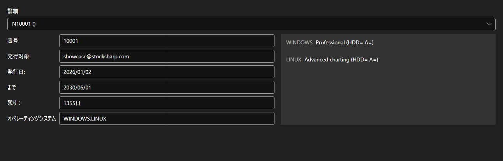

# ライセンス



[LicensePanel](xref:StockSharp.Xaml.LicensePanel) - インストール済みライセンスのパネルです。上部の一覧でライセンスを選ぶと、その番号、発行先、発行日と有効期限、残り日数、対応するオペレーティングシステムが下に表示され、右側には許可されている機能が並びます。

**主なプロパティ**

- [LicensePanel.Licenses](xref:StockSharp.Xaml.LicensePanel.Licenses) - ライセンスの一覧。

このパネルはバージョン情報ウィンドウや初回起動ウィザードに組み込まれ、どのライセンスが期限切れになるか、どの機能が不足しているかがすぐ分かります。

以下は使用例のコード断片です:

```xaml
<Window x:Class="Sample.LicenseWindow"
	xmlns="http://schemas.microsoft.com/winfx/2006/xaml/presentation"
	xmlns:x="http://schemas.microsoft.com/winfx/2006/xaml"
	xmlns:xaml="http://schemas.stocksharp.com/xaml"
	Height="400" Width="800">
	<xaml:LicensePanel x:Name="LicensePanel" />
</Window>
```

```cs
// インストール済みのライセンスを表示します
LicensePanel.Licenses = LicenseHelper.Licenses;
```

## 関連項目

[サービスパネル](../service_panels.md)
