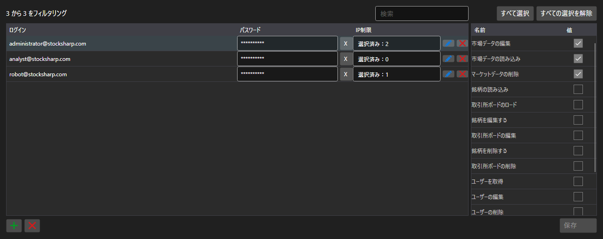

# アカウントと権限



[PermissionCredentialsPanel](xref:StockSharp.Xaml.PermissionCredentialsPanel) - アクセス権限付きのサーバーアカウント一覧です。各エントリについて、データのダウンロード、編集、発注、サーバー管理といった操作の可否を指定します。

**主なプロパティ**

- [PermissionCredentialsPanel.Credentials](xref:StockSharp.Xaml.PermissionCredentialsPanel.Credentials) - アカウントの一覧。
- [PermissionCredentialsPanel.ChangedCredentials](xref:StockSharp.Xaml.PermissionCredentialsPanel.ChangedCredentials) - 前回の保存以降に変更されたエントリ。
- [PermissionCredentialsPanel.SaveText](xref:StockSharp.Xaml.PermissionCredentialsPanel.SaveText) - 保存ボタンの表示文字列。

パネル自身はエントリを保存しません。ボタンを押すと `Saving` イベントが発生し、アプリケーションが変更されたアカウントを書き込んで [PermissionCredentialsPanel.MarkSaved](xref:StockSharp.Xaml.PermissionCredentialsPanel.MarkSaved) を呼ぶと、変更一覧がクリアされます。

以下は使用例のコード断片です:

```xaml
<Window x:Class="Sample.CredentialsWindow"
	xmlns="http://schemas.microsoft.com/winfx/2006/xaml/presentation"
	xmlns:x="http://schemas.microsoft.com/winfx/2006/xaml"
	xmlns:xaml="http://schemas.stocksharp.com/xaml"
	Height="500" Width="900">
	<xaml:PermissionCredentialsPanel x:Name="CredentialsPanel" />
</Window>
```

```cs
// サーバーのアカウントを表示します
CredentialsPanel.Credentials.AddRange(_server.Credentials);

// 変更されたエントリだけを保存します
CredentialsPanel.Saving += () =>
{
	foreach (var credentials in CredentialsPanel.ChangedCredentials)
		_server.Save(credentials);

	// 変更一覧をクリアします
	CredentialsPanel.MarkSaved();
};
```

## 関連項目

[サービスパネル](../service_panels.md)
