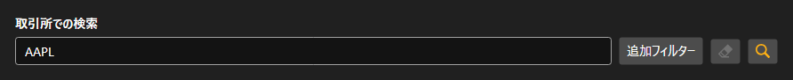

# 銘柄検索



[SecurityLookupPanel](xref:StockSharp.Xaml.SecurityLookupPanel) - 銘柄を検索するパネルです。検索欄にコードまたはその一部を入力し、追加フィルタのボタンを押すと [Security](xref:StockSharp.BusinessEntities.Security) のエディタが開き、種別、取引所、通貨、満期日を指定できます。

パネル自身は検索を行いません。検索ボタンまたは Enter キーで、入力済みのフィルタを伴う `Lookup` イベントを発生させます。その先でコネクタへ問い合わせるのか、ローカルストレージを探すのかはアプリケーションが決めます。

以下は使用例のコード断片です:

```xaml
<Window x:Class="Sample.LookupWindow"
	xmlns="http://schemas.microsoft.com/winfx/2006/xaml/presentation"
	xmlns:x="http://schemas.microsoft.com/winfx/2006/xaml"
	xmlns:xaml="http://schemas.stocksharp.com/xaml"
	Height="500" Width="400">
	<xaml:SecurityLookupPanel x:Name="LookupPanel" />
</Window>
```

```cs
// 検索要求をコネクタへ送ります
LookupPanel.Lookup += filter =>
{
	// フィルタは入力済みで渡されます
	_connector.Subscribe(new Subscription(filter.ToLookupMessage()));
};

// 見つかった銘柄をテーブルに表示します
_connector.SecurityReceived += (subscription, security) =>
	this.GuiAsync(() => SecurityGrid.Securities.Add(security));
```

## 関連項目

[サービスパネル](../service_panels.md)
